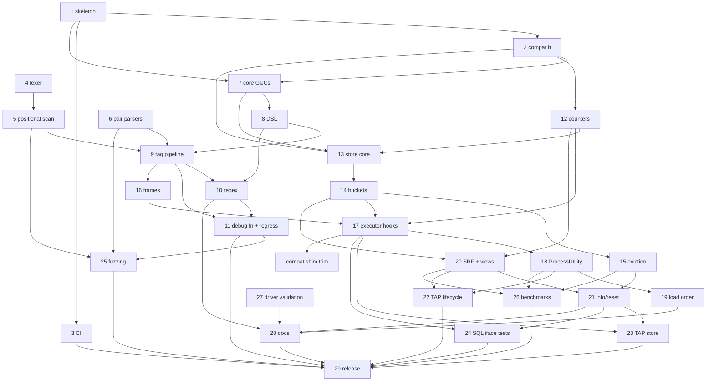

# pg_stat_statement_context — Backlog

This backlog breaks [DESIGN.md](DESIGN.md) (Draft) into concrete, implementable
tasks. Section references (§N) point to DESIGN.md.

## How to read this backlog

**Task IDs** use the format `YYYYMMDD-HHMMSS-N`. The `YYYYMMDD-HHMMSS` part is
the local time at which a batch of tasks was written, and `N` numbers the tasks
in that batch sequentially from 1. Every task in this file shares the prefix
`20261005-091225`. To add tasks, use your own current timestamp as the prefix
and start again at 1, so that people adding tasks at the same time don't create
the same ID. Never renumber or reuse an ID.

**Fields** for each task:

- **Description**: what to build, scoped so that one engineer or agent can
  complete it, with references to DESIGN.md.
- **Acceptance criteria**: brief, testable conditions for done.
- **Depends on**: task IDs that must be finished first, or `none`.
- **Open questions**: undecided design questions that must be answered
  **before** the task can start, or `none`. These cover only things that
  DESIGN.md leaves open, ambiguous, or TBD. Smaller choices that an implementer
  can make on their own, then document and confirm in review, are listed as
  *Design notes* instead and don't block the task.
- **Status**:
  - `ready`: every dependency is done and there are no open questions.
  - `blocked-on-deps`: there are no open questions, but at least one dependency
    is unfinished.
  - `blocked-on-questions`: the task has open questions. This status takes
    precedence when a task also has unfinished dependencies, because the
    questions can be answered now, in parallel with the dependency work.
    Dependencies are still listed in the table.

The backlog has two parts: **v1** (tasks 1–29, plus later additions
20261005-101154-1 and 20261005-103941-1) and the **post-v1 roadmap** (tasks
30, 32–35, 38, 39, 41, 42, 45, and 46, §8). Roadmap tasks 31, 36, 37, 40, 43,
and 44 were dropped on 2026-10-05 as out of scope for a `pg_stat_statements`
companion; they are archived under "Dropped" in BACKLOG-COMPLETE.md. Any
roadmap task that adds SQL objects or columns must ship
an extension upgrade script (for example `--1.0--1.1.sql`) rather than edit the
frozen 1.0 script.

**Scope decision (2026-10-05):** the extension is a companion to
`pg_stat_statements`, not a replacement. Per (queryid × context) it stores only
`calls` and `total_exec_time`; every other statistic comes from pgss via a join
on `(userid, dbid, queryid, toplevel)` (DESIGN.md §5.1, §7).

## Summary

| ID | Title | Depends on | Has open questions | Status |
|----|-------|------------|--------------------|--------|
| 20261006-010149-1 | Exporter-friendly SQL surface: monotonic counters and bucket metadata | 20261005-091225-42 | no | ready |
| 20261006-075124-1 | Fewer eviction passes under sustained churn (adaptive batch or compact scan) | 20261006-043919-1 | no | ready |
| 20261006-192058-1 | TAP tests: detect pg_stat_statements portably; fix the macOS failures in 010–019 | none | no | ready |
| 20261006-192058-3 | Host runs of docker/run-tests.sh: skip worktrees/, stop the server on failure | none | no | ready |
| 20261006-143225-1 | Close the deadline-postponement race in the test module's sleep injection | 20261006-113156-1 | no | ready |
| 20261005-213120-1 | `_info()`: distinguish live eviction from expired-entry reclamation | 20261005-091225-21 | no | ready |
| 20261005-091225-29 | v1 release readiness | 20261005-091225-3, 20261005-091225-11, 20261005-091225-22, 20261005-091225-23, 20261005-091225-24, 20261005-091225-25, 20261005-091225-26, 20261005-091225-28, 20261005-213120-1, 20261006-010149-1, 20261005-091225-32 | no | blocked-on-deps |
| 20261005-091225-33 | Roadmap: exemplars for excluded high-cardinality keys | 20261005-091225-17, 20261005-091225-20 | no | ready |
| 20261005-091225-34 | Roadmap: background worker reclaiming dead entries | 20261005-091225-15 | no | ready |
| 20261005-091225-35 | Roadmap: persist stats across clean restarts | 20261005-091225-15, 20261005-091225-21 | no | ready |
| 20261005-091225-45 | Roadmap: distribution packaging and provider outreach | 20261005-091225-29 | no | blocked-on-deps |
| 20261005-091225-46 | Roadmap: upstream proposal for a statement-comment hook | 20261005-091225-26, 20261005-091225-29 | no | blocked-on-deps |

### How the DESIGN.md §11 open questions were resolved

All seven §11 questions were answered by the project owner on 2026-10-05.

| §11 question | Resolution | Recorded in task |
|--------------|------------|------------------|
| Q1: record the empty tag set by default? | No: `untagged = skip` is the default | 20261005-091225-29 |
| Q2: `jsonb` vs fixed columns for `tags` | `jsonb` | 20261005-091225-20 |
| Q3: DSL in one GUC vs a `config_file` | GUCs only; `ALTER SYSTEM` + `pg_reload_conf()` from SQL | 20261005-091225-31 (dropped), 20261005-091225-28 |
| Q4: is `utility_textid` worth it? | No; pgss has the same PG14/15 behavior | 20261005-091225-37 (dropped) |
| Q5: `bucket_id` in key vs per-entry bucket ring | Per-entry counter ring | 20261005-091225-13, -14, -15 |
| Q6: error-count dedup rules; cancellations separate? | Moot: error counts dropped | 20261005-091225-40 (dropped) |
| Q7: load-order violation: `WARNING` vs disable utility tracking | `WARNING` only | 20261005-091225-19 |

Other blocking questions came up while decomposing the design. Those on tasks
8, 9, 12, 21, 30, 32, 35, 38, and 41 were answered on 2026-10-05 (see each
task's **Decisions**). No task currently has open questions.

### Dependency overview (v1)

Short labels: `T1` = `20261005-091225-1`, and so on.

`C1` = `20261005-103941-1`. No v1 task has open questions any more (so none is
marked `?`). Every dependency points to a lower-numbered task, or (for `C1`)
to an older task, so the graph is acyclic. 20261005-101154-1 has no
dependencies and is not shown.

---

## v1 tasks

### 20261006-010149-1: Exporter-friendly SQL surface: monotonic counters and bucket metadata

**Description:** Found while writing the exporter recipes (item -42). None of the views has a counter that only grows: `_totals` is a sliding window and bucket rows expire. So Prometheus `rate()` can't be used, and the recipes export gauges over the last closed bucket instead. They also hard-code the bucket length GUC and the hidden 2000-01-01 starting point for buckets. Proposed additions:
1. Bucket metadata in `_info()`: `bucket_seconds`, `current_bucket_start`, `last_closed_bucket_start`.
2. Optionally a `pg_stat_statement_context_last_bucket` view, which gives the last closed bucket per entry.
3. Optionally counters per entry that only grow (`calls_total`, `exec_time_total` plus `stats_since`) and survive bucket expiry until the entry is evicted. This costs extra shared-memory bytes per entry.
4. An epoch-number form of `stats_reset`, or let the recipes keep converting it.

Once this lands, simplify the recipes in `docs/integrations/` and update `scripts/test-integrations.sh`.

**Acceptance criteria:**
- The chosen columns or views exist, are documented in §7 and `docs/sql-interface.md`, and are tested in TAP or 019.
- The recipes no longer depend on the epoch or bucket-length GUC.

**Decisions:**
- 2026-10-06: Build additions 1 (bucket metadata in `_info()`: `bucket_seconds`, `current_bucket_start`, `last_closed_bucket_start`), 2 (`pg_stat_statement_context_last_bucket` view) and 4 (epoch-number form of `stats_reset`). Addition 3 was initially deferred; see the next decision.
- 2026-10-06: Do it together with 20261005-213120-1 in one builder run, before `--1.0.sql` is frozen.
- 2026-10-06 (later): The owner wants addition 3 in v1 as well: pgss-style monotonic per-entry counters (`calls_total`, `exec_time_total`, `stats_since`) that only reset on eviction or `_reset()`, so exporters can use `rate()`. Expect about 16–24 bytes more shared memory per entry; update the §5 sizing numbers.

**Depends on:** 20261005-091225-42
**Open questions:** none
**Status:** ready

### 20261006-075124-1: Fewer eviction passes under sustained churn (adaptive batch or compact scan)

**Description:** Follow-up to 20261006-043919-1. Partial selection made a pass ~40% faster, but under the `evict` benchmark at `max_entries=10000` p99 is still ~2.15× pgss alone (target ~1.5×). The remaining cost is the single scan of ~10,000 entries (~870 B each, ~8.7 MB) under the exclusive lock. Options:
1. Adaptive batch: evict a larger fraction (e.g. up to 20%) when passes come close together. A throwaway build gave Δp99 +34% (TPS −7.6%) on a noisy run. Changes §5.3 semantics (target is no longer a fixed ~5%), loses more history of rare combinations.
2. A compact per-entry array of (`last_bucket`, `usage`, entry pointer) maintained in shared memory, so the pass scans ~16–24 B per entry instead of whole entries. Keeps §5.3 semantics; more code and shared memory.

**Acceptance criteria:** eviction-benchmark p99 at `max_entries=10000` ≤ ~1.5× pgss alone on PG 18 (or gap explained); §5.3 updated if semantics change; TAP 008/009/018 pass; numbers in docs/benchmarks.md.

**Decisions:**
- 2026-10-06: Do option 2 (compact per-entry array, keeps §5.3 semantics) first; only if p99 is still over ~1.5× pgss, add option 1 (adaptive batch) and update §5.3.

**Depends on:** 20261006-043919-1
**Open questions:** none
**Status:** ready

### 20261006-192058-1: TAP tests: detect pg_stat_statements portably; fix the macOS failures in 010–019

**Description:** In CI run 37535041023, the macOS cells failed. Tests 010–019 detect pg_stat_statements with `-e "$pkglibdir/pg_stat_statements.so"`, but on PG16+ macOS the module suffix is `.dylib`. So on macOS PG16–18, every pgss parity check was silently skipped (`plan skip_all` in 014, 017 and 019). Fix the detection (any of `.so`, `.dylib`, `.dll`), ideally through one shared helper instead of eight copies. Make a missing pgss a hard failure when the harness sets `PSSC_REQUIRE_PGSS=1`, so this can't silently recur. Set that variable in `docker/run-tests.sh`, because every harness image and the macOS build install pgss. Then fix the failures that the corrected detection, or macOS itself, exposes:
- **013 #19:** the `set_conf('extractors', marginalia(position=prepend))` that test 19 relies on sits inside the pgss `SKIP` block. Move the setup out of it so test 19 doesn't depend on pgss.
- **014:** the real-load "spelling variant" cases hardcode `.so` (`pg_stat_statements.so`, `"$libdir/$P.so"`). Use the platform's suffix. The matcher-only cases (`pssc_guc_test_load_order_wrong`) stay as they are, because `src/utility.c` strips every known suffix.
- **012 #17–20:** with `track_utility = off`, a CALL/DO only nests on PG14–16 when pgss tracks it. Without pgss loaded, that falls back to this extension's own settings (src/utility.c `pgss_nests_utility`), so the children are top level there. Today the expectation assumes pgss is loaded. Make it follow `$have_pgss` and the version (on PG17+ it always nests).
- **012 #202:** `ORDER BY step, tags::text` depends on collation. In C or byte order, `tx_outer` sorts before `tx`. Make the order deterministic, e.g. `COLLATE "C"` with the expected list adjusted.

Verified locally on macOS (arm64, source builds, `docker/run-tests.sh`): with `.dylib` detection on PG18, 013, 014, 016, 017 and 019 pass, and only 012 #202 and 022 still fail.

**Acceptance criteria:**
- On macOS PG18 (host run of `docker/run-tests.sh` with `PSSC_REQUIRE_PGSS=1`), the pgss-dependent tests run rather than skip, and 010–019 pass; 012 and 013 also pass with pgss absent on PG14–16 and PG17+.
- The Docker harness passes on PG14–18 (`scripts/docker-test.sh <major>`).
- With `PSSC_REQUIRE_PGSS=1` and pgss genuinely missing, the tests fail rather than skip.

**Depends on:** none
**Open questions:** none
**Status:** ready

### 20261006-192058-3: Host runs of docker/run-tests.sh: skip worktrees/, stop the server on failure

**Description:** `docker/run-tests.sh` (used on the host by the macOS CI cells and locally) has two problems:
- **It copies `worktrees/`.** The source copy excludes `./tmp` but not `./worktrees`, so the version-guard check scans every worktree's `src/compat.h` and fails. The same applies to `scripts/docker-test.sh` run from the main checkout, which mounts the whole repo. Exclude `./worktrees` (and keep the check scanning only the copied tree).
- **It leaks a server on failure.** `fail()` exits without stopping the server that `pg_start` started. In Docker the container dies with it, but on a host it stays up on the default port, and the next run then fails with "Address already in use". Stop it (`pg_ctl -m immediate`, tolerating "not running") from the failure and exit paths.

**Acceptance criteria:**
- A run from a checkout that contains `worktrees/` passes the version-guard step (a test that fails before the fix).
- After a failing host run, no postmaster from `$PSSC_WORK` is left running (a test that fails before the fix).
- The Docker harness passes on PG14–18.

**Depends on:** none
**Open questions:** none
**Status:** ready

### 20261006-143225-1: Close the deadline-postponement race in the test module's sleep injection

Split from 20261006-113156-1 (final review finding, not fixed within 2 rounds). In `test/modules/pssc_extract_test/pssc_extract_test.c` (around lines 342–355), the `sleep`/`regsleep` injections snapshot whether the compile deadline is pending, then postpone it with `pssc_regex_test_expire_in(60000)`. If the original 100 ms deadline fires between the snapshot and the postponement (the backend is descheduled there), the postponement doesn't clear the already-pending self-cancel. The loop then treats it as a genuine cancel and returns after almost no CPU time, so the attempt is classified as a stall and retried without the injection. That is the original load-dependent 006 failure, now in a much narrower window.

Fix options: block SIGALRM around the snapshot and postponement, or expose deadline ownership (the runtime's own "our cancel vs foreign cancel" state) through a PGDLLEXPORT test helper so the loop can tell a raced self-cancel from a genuine one.

**Acceptance criteria:**
- A deterministic test (for example a test hook that fires the deadline between the snapshot and the postponement) fails before the fix and passes after.
- The 006 cancel/terminate/statement_timeout tests from 20261006-113156-1 still pass; the full harness passes on PG14–18.

**Depends on:** 20261006-113156-1
**Open questions:** none
**Status:** ready

### 20261005-213120-1: `_info()`: distinguish live eviction from expired-entry reclamation

**Description:** Found while documenting (item -28). `evicted_entries` counts both expired entries reclaimed by an eviction pass and live entries evicted, and `dealloc` counts passes. `dropped_records` (calls lost because a pass freed nothing) is not exposed. So `_info()` alone cannot tell an operator that `max_entries` is too small, contrary to DESIGN §5.3 step 3. The docs currently give a workaround: compare the row count of `pg_stat_statement_context_totals` with `max_entries`.

Proposed: split the counter into `reclaimed_entries` (expired or dead, harmless) and `evicted_entries` (live, history lost), and expose `dropped_records`. Update §5.3, §7, the docs and tests.

**Acceptance criteria:**
- Expired-only reclamation moves `reclaimed_entries`, not `evicted_entries`.
- Undersized churn moves `evicted_entries`.
- A full table with nothing to free moves `dropped_records`.
- The docs' undersizing guidance uses the new counters.

**Decisions:**
- 2026-10-06: Approved: split into `reclaimed_entries` (expired/dead), `evicted_entries` (live only) and add `dropped_records`. Do it in the same builder run as 20261006-010149-1 (one `_info()` change), before `--1.0.sql` is frozen (no upgrade script).

**Depends on:** 20261005-091225-21
**Open questions:** none
**Status:** ready

### 20261005-091225-29: v1 release readiness

**Description:** Prepare and cut the v1.0 release:
- Confirm the defaults (including `untagged = skip`), then freeze `--1.0.sql`. Later changes go into upgrade scripts.
- Verify `make install` from a clean checkout on every CI cell, including the assert and Valgrind jobs.
- Check that the benchmark numbers are published.
- Check that DESIGN.md §11 records how each question was resolved (done on 2026-10-05) and that the release notes summarize them.
- Add a CHANGELOG, tag `v1.0.0`, and create a GitHub release.

**Acceptance criteria:**
- The checklist is complete, CI is green, the tag and release exist, and the README install steps work from a clean checkout.

**Decisions:**
- 2026-10-05 (§11 Q1): Untagged statements are **skipped** by default (`untagged = skip`); `untagged = record` stays available. The sizing guidance assumes this default.
- 2026-10-06 (Q1): Finish 20261005-213120-1 and 20261006-010149-1 before freezing `--1.0.sql`.
- 2026-10-06 (Q2): Moot; 20261006-043919-1 landed. 20261006-075124-1 is not a v1 blocker.
- 2026-10-06 (Q3): The **owner** pushes, tags `v1.0.0` and creates the GitHub release. The agent prepares everything locally (CHANGELOG, release notes, freeze) and stops before pushing.
- 2026-10-06: v1.0 ships the roadmap features already built: appname, normalize, activity view, tags_override, and per-key cardinality caps (20261005-091225-32).

**Depends on:** 20261005-091225-3, 20261005-091225-11, 20261005-091225-22, 20261005-091225-23, 20261005-091225-24, 20261005-091225-25, 20261005-091225-26, 20261005-091225-28, 20261005-213120-1, 20261006-010149-1, 20261005-091225-32
**Open questions:** none
**Status:** blocked-on-deps

---

## Post-v1 roadmap tasks (§8)

### 20261005-091225-33: Roadmap: exemplars for excluded high-cardinality keys

**Description:** Store the most recent value of explicitly listed high-cardinality keys (for example `traceparent`) per entry, so users can jump from an aggregate to a real trace (§8 v1.x). The visibility rules from §6.11 apply.

*Owner's note (2026-10-05):* the task is kept. An exemplar stores the most recent value of a high-cardinality key (e.g. `traceparent`) per entry.

**Acceptance criteria:**
- The exemplar column shows the latest value without adding new entries.
- It is `NULL` for unprivileged roles viewing other roles' rows.
- Only keys in the exemplar GUC are stored. Total exemplar memory never exceeds the configured cap.
- The upgrade script is provided.

**Depends on:** 20261005-091225-17, 20261005-091225-20
**Decisions (2026-10-05):**
- Exemplar keys come from an explicit list in a dedicated GUC (e.g. `pg_stat_statement_context.exemplar_keys`). The denylist (`exclude_tags`) does not double as the exemplar list. A key may need to be both denylisted (so it isn't grouped by) and listed as an exemplar.
- Exemplar storage has a memory cap set by a config value (a postmaster-level GUC, since it sizes shared memory). Values that would exceed the cap are truncated or dropped (implementer's choice, documented and counted in `_info()`).

**Open questions:** none

**Status:** ready

### 20261005-091225-34: Roadmap: background worker reclaiming dead entries

**Description:** Add an optional background worker that, on idle systems, advances `current_bucket` and reclaims dead entries (every ring slot expired) so their space is free before the next insert needs it (§8 v1.x, §5.2, §5.3). It isn't needed for correctness, because readers already filter expired slots and eviction reclaims dead entries first. Enable it with a postmaster GUC.

**Acceptance criteria:**
- With the worker enabled, dead entries are freed without any query traffic, and `_info().entries` drops accordingly.
- Disabling it changes nothing else.

**Depends on:** 20261005-091225-15
**Open questions:** none
**Status:** ready

### 20261005-091225-35: Roadmap: persist stats across clean restarts

**Description:** Dump the stats at shutdown and load them at startup, like `pg_stat_statements.save` (§8 v1.x). Use a versioned file format with a header that records the extension version, epoch, `bucket_interval`, `bucket_count`, and sizing. Follow pgss's lead on mismatches:
- On a file-format or extension-version mismatch, discard the file.
- If `bucket_interval` or `bucket_count` changed, discard the file (pgss has no bucket analogue).
- If `max_entries` shrank, load what fits and evict the rest using the §5.3 order.
- Otherwise keep the stored epoch, so `bucket_id`s stay valid, and drop slots that expired during the downtime.

*Design note* (non-blocking): `max_tagset_bytes` changes are not covered by the decision. Proposed: load entries whose tag set still fits the new limit and skip (and log a count of) the rest.

**Acceptance criteria:**
- Stats survive a clean restart.
- Each mismatch case above behaves as specified, with a log message.
- A crash or a corrupt file starts empty with a log message.
- The behavior is controlled by a GUC.

**Decisions:**
- 2026-10-05: Follow pg_stat_statements: discard on format/version mismatch; if `max_entries` shrank, load what fits and evict the rest; if `bucket_interval` or `bucket_count` changed, discard.

**Depends on:** 20261005-091225-15, 20261005-091225-21
**Open questions:** none
**Status:** ready

### 20261005-091225-45: Roadmap: distribution packaging and provider outreach

**Description:** Package and distribute the extension (§8 v3):
- PGXN `META.json` and an upload
- PGDG apt/yum packaging requests
- a Homebrew formula
- Docker images based on the official postgres images

Also contact the managed providers (RDS, Cloud SQL, Azure) about adding the extension to their allowlists (§6.12).

**Acceptance criteria:**
- Each package installs, and `CREATE EXTENSION` works.
- The outreach is logged, with contacts and status.

**Depends on:** 20261005-091225-29
**Open questions:** none
**Status:** blocked-on-deps

### 20261005-091225-46: Roadmap: upstream proposal for a statement-comment hook

**Description:** Write and send a pgsql-hackers proposal for a core hook or field for statement comments, or a query-tag mechanism, that would benefit pgss and similar extensions (§8 v3). Use the benchmark data and the limitations (§6.2, §6.3, §6.6) as motivation.

**Acceptance criteria:**
- The proposal is posted, and the thread link and outcome are recorded in the repository.

**Depends on:** 20261005-091225-26, 20261005-091225-29
**Open questions:** none
**Status:** blocked-on-deps
