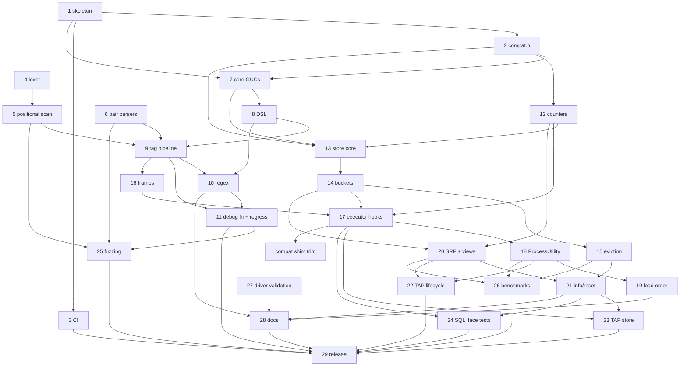

# pg_stat_statement_context — Backlog

This backlog breaks [DESIGN.md](DESIGN.md) (Draft) into concrete, implementable
tasks. Section references (§N) point to DESIGN.md.

## How to read this backlog

**Task IDs** use the format `YYYYMMDD-HHMMSS-N`. The `YYYYMMDD-HHMMSS` part is
the local time at which a batch of tasks was written, and `N` numbers the tasks
in that batch sequentially from 1. Every task in this file shares the prefix
`20261005-091225`. To add tasks, use your own current timestamp as the prefix
and start again at 1, so that people adding tasks at the same time don't create
the same ID. Never renumber or reuse an ID.

**Fields** for each task:

- **Description**: what to build, scoped so that one engineer or agent can
  complete it, with references to DESIGN.md.
- **Acceptance criteria**: brief, testable conditions for done.
- **Depends on**: task IDs that must be finished first, or `none`.
- **Open questions**: undecided design questions that must be answered
  **before** the task can start, or `none`. These cover only things that
  DESIGN.md leaves open, ambiguous, or TBD. Smaller choices that an implementer
  can make on their own, then document and confirm in review, are listed as
  *Design notes* instead and don't block the task.
- **Status**:
  - `ready`: every dependency is done and there are no open questions.
  - `blocked-on-deps`: there are no open questions, but at least one dependency
    is unfinished.
  - `blocked-on-questions`: the task has open questions. This status takes
    precedence when a task also has unfinished dependencies, because the
    questions can be answered now, in parallel with the dependency work.
    Dependencies are still listed in the table.

The backlog has two parts: **v1** (tasks 1–29, plus later additions
20261005-101154-1 and 20261005-103941-1) and the **post-v1 roadmap** (tasks
30, 32–35, 38, 39, 41, 42, 45, and 46, §8). Roadmap tasks 31, 36, 37, 40, 43,
and 44 were dropped on 2026-10-05 as out of scope for a `pg_stat_statements`
companion; they are archived under "Dropped" in BACKLOG-COMPLETE.md. Any
roadmap task that adds SQL objects or columns must ship
an extension upgrade script (for example `--1.0--1.1.sql`) rather than edit the
frozen 1.0 script.

**Scope decision (2026-10-05):** the extension is a companion to
`pg_stat_statements`, not a replacement. Per (queryid × context) it stores only
`calls` and `total_exec_time`; every other statistic comes from pgss via a join
on `(userid, dbid, queryid, toplevel)` (DESIGN.md §5.1, §7).

## Summary

| ID | Title | Depends on | Has open questions | Status |
|----|-------|------------|--------------------|--------|
| 20261005-091225-29 | v1 release readiness | 20261005-091225-3, 20261005-091225-11, 20261005-091225-22, 20261005-091225-23, 20261005-091225-24, 20261005-091225-25, 20261005-091225-26, 20261005-091225-28, 20261005-213120-1, 20261006-010149-1, 20261005-091225-32, 20261007-070036-1, 20261007-133120-1, 20261008-065635-1, 20261008-065635-2, 20261008-065635-3 | no | blocked-on-deps |
| 20261008-065635-3 | Release-build hygiene: test-only code out of the shipped library, exports, build identification, load validation | none | no | ready |
| 20261008-065635-5 | Broader memory-checker coverage | none | no | ready |
| 20261008-065635-6 | Discriminating checksum test and concurrent-reader consistency tests | 20261008-065635-3 | no | blocked-on-deps |
| 20261008-065635-7 | Hook coexistence tests and a pg_stat_statements parity checklist | none | no | ready |
| 20261008-065635-8 | Managed-service operator guide: privileges, parameter groups, troubleshooting | 20261008-065635-2 | no | ready |
| 20261008-065635-9 | Upgrade, downgrade and uninstall procedures | 20261008-065635-2, 20261008-065635-3 | no | blocked-on-deps |
| 20261008-065635-11 | Cardinality pressure guidance: caps vs tag-set combinations | 20261008-065635-2 | no | ready |
| 20261008-065635-12 | Managed-server-safe smoke test target | 20261008-065635-2 | no | ready |
| 20261008-065635-13 | Benchmark requalification on the release commit | 20261008-065635-1, 20261008-065635-2, 20261008-065635-3 | no | blocked-on-deps |
| 20261008-065635-14 | Release-tree and design-doc cleanup | 20261008-065635-13 | no | blocked-on-deps |
| 20261008-092913-1 | Warn at startup when pg_stat_monitor is loaded after this extension | 20261008-065635-7 | no | blocked-on-deps |
| 20261008-092913-2 | Isolate Docker test image tags per worktree | 20261008-065635-3 | no | blocked-on-deps |
| 20261005-091225-45 | Roadmap: distribution packaging and provider outreach | 20261005-091225-29 | no | blocked-on-deps |
| 20261005-091225-46 | Roadmap: upstream proposal for a statement-comment hook | 20261005-091225-26, 20261005-091225-29 | no | blocked-on-deps |

### How the DESIGN.md §11 open questions were resolved

All seven §11 questions were answered by the project owner on 2026-10-05.

| §11 question | Resolution | Recorded in task |
|--------------|------------|------------------|
| Q1: record the empty tag set by default? | No: `untagged = skip` is the default | 20261005-091225-29 |
| Q2: `jsonb` vs fixed columns for `tags` | `jsonb` | 20261005-091225-20 |
| Q3: DSL in one GUC vs a `config_file` | GUCs only; `ALTER SYSTEM` + `pg_reload_conf()` from SQL | 20261005-091225-31 (dropped), 20261005-091225-28 |
| Q4: is `utility_textid` worth it? | No; pgss has the same PG14/15 behavior | 20261005-091225-37 (dropped) |
| Q5: `bucket_id` in key vs per-entry bucket ring | Per-entry counter ring | 20261005-091225-13, -14, -15 |
| Q6: error-count dedup rules; cancellations separate? | Moot: error counts dropped | 20261005-091225-40 (dropped) |
| Q7: load-order violation: `WARNING` vs disable utility tracking | `WARNING` only | 20261005-091225-19 |

Other blocking questions came up while decomposing the design. Those on tasks
8, 9, 12, 21, 30, 32, 35, 38, and 41 were answered on 2026-10-05 (see each
task's **Decisions**). No task currently has open questions.

### Dependency overview (v1)

Short labels: `T1` = `20261005-091225-1`, and so on.

`C1` = `20261005-103941-1`. No v1 task has open questions any more (so none is
marked `?`). Every dependency points to a lower-numbered task, or (for `C1`)
to an older task, so the graph is acyclic. 20261005-101154-1 has no
dependencies and is not shown.

---

## v1 tasks

### 20261005-091225-29: v1 release readiness

**Description:** Prepare and cut the v1.0 release:
- Confirm the defaults (including `untagged = skip`), then freeze `--1.0.sql`. Later changes go into upgrade scripts.
- Verify `make install` from a clean checkout on every CI cell, including the assert and Valgrind jobs.
- Check that the benchmark numbers are published.
- Check that DESIGN.md §11 records how each question was resolved (done on 2026-10-05) and that the release notes summarize them.
- Add a CHANGELOG, tag `v1.0.0`, and create a GitHub release.

**Acceptance criteria:**
- The checklist is complete, CI is green, the tag and release exist, and the README install steps work from a clean checkout.

**Decisions:**
- 2026-10-05 (§11 Q1): Untagged statements are **skipped** by default (`untagged = skip`); `untagged = record` stays available. The sizing guidance assumes this default.
- 2026-10-06 (Q1): Finish 20261005-213120-1 and 20261006-010149-1 before freezing `--1.0.sql`.
- 2026-10-06 (Q2): Moot; 20261006-043919-1 landed. 20261006-075124-1 is not a v1 blocker.
- 2026-10-06 (Q3): The **owner** pushes, tags `v1.0.0` and creates the GitHub release. The agent prepares everything locally (CHANGELOG, release notes, freeze) and stops before pushing.
- 2026-10-06: v1.0 ships the roadmap features already built: appname, normalize, activity view, tags_override, and per-key cardinality caps (20261005-091225-32).
- 2026-10-06 (owner, after -33/-34/-35 landed): **fold 1.1 into 1.0.** 1.0 was never released, so the first release is HEAD as v1.0.0: `--1.0--1.1.sql` (exemplars) is merged into `sql/pg_stat_statement_context--1.0.sql`, the upgrade script is deleted, `default_version = '1.0'`, and `sql/frozen.sha256` holds the new checksum. The freeze policy is unchanged: from v1.0.0 on, SQL changes go into upgrade scripts. v1.0.0 also ships the reclaim worker (-34), persistence (`save`, -35) and exemplars (-33).

**Progress (2026-10-06, agent):** everything up to the owner's steps is done:
- `untagged` defaults to `skip` (`src/guc.c`). `--1.0.sql` is frozen (header comment, `sql/frozen.sha256`, `scripts/check-frozen-sql.sh` in CI and `docker/run-tests.sh`; DESIGN.md §7).
- `CHANGELOG.md` and `docs/release-notes/v1.0.0.md` added; the notes summarize the §11 resolutions. §11 is accurate. Benchmark numbers are committed in `docs/benchmarks.md`.
- Local matrix in Docker: PGDG 14–18, `--assert` 14–18 and `--valgrind 18` all pass; README install + quick start verbatim from a fresh `git clone` on PG 14 and 18.
- Fixed on the way: `docker/Dockerfile.source` passed the release as `ARG PG_VERSION`, which the base image's `ENV PG_VERSION` overrides under the legacy builder (tarball 404); renamed to `PG_SOURCE_VERSION`.
- (Superseded by the progress note below: -33, -34 and -35 landed afterwards.)

**Progress (2026-10-06 evening, agent, after the 1.1 fold; commit 6264c97):**
- 1.1 folded into 1.0 per the owner's decision above: `--1.0.sql` defines the exemplar columns, `--1.0--1.1.sql` and the `_1_1` C symbols are gone, `default_version = '1.0'`, `sql/frozen.sha256` re-recorded (`scripts/check-frozen-sql.sh` has no re-record mode, so the manifest line was edited). A catalog comparison on PG 18 of old 1.0 + upgrade vs. the folded script showed identical signatures, volatility/parallel/strict labels, ACLs and view definitions (only the C symbol names differ).
- CHANGELOG `[1.0.0]` and `docs/release-notes/v1.0.0.md` now include the reclaim worker, `save` and exemplars; they are off the post-v1 list. `save` is now documented in `docs/configuration.md`; limitations/sql-interface/integrations no longer say statistics are lost on every restart. DESIGN.md §6.13, §7, §8, §9 updated; §11 unchanged and accurate.
- Matrix from a fresh `git clone` of 6264c97 (`scripts/docker-test.sh`): PGDG 14.24, 15.19, 16.15, 17.11, 18.6 PASS; `--assert` 14.24, 15.19, 17.11, 18.6 PASS; `--assert` 16.15 FAIL once (timing flake in `017_lifecycle.pl`: a `RELEASE SAVEPOINT` took 5.6 ms in our hook vs 0.11 ms in pgss's, over the 2 ms slack; unrelated to the fold), PASS on rerun, tracked as 20261006-220356-1; `--valgrind 18` PASS (no Valgrind errors in 13 + 33 processes). Unit tests (ASan/UBSan), version-guard and frozen-SQL checks (+ self-tests) pass in every cell and on the host. `fuzz/run-libfuzzer.sh -t 15`: all 4 targets ok.
- README install + quick start verbatim (code blocks extracted from the committed README) from the fresh clone on PG 14 and 18: `make`, `make install`, both `CREATE EXTENSION`s, the quick-start output matches (2 rows, calls 2 and 1), `_extract()` returns the documented tags, extversion 1.0, no server-log warnings.
- Not run: `scripts/test-integrations.sh` (pulling the third-party images failed in this environment: Docker credential helper error).
- Benchmarks in `docs/benchmarks.md` were measured at 22f9e0f, before -33/-34/-35 (all off by default or off the hot path); not re-run.
- **Remaining (owner):** push `main`, wait for CI to be green, tag `v1.0.0`, create the GitHub release from `docs/release-notes/v1.0.0.md`, then run `scripts/backlog-complete.py 20261005-091225-29`.

**Progress (2026-10-07, agent, matrix rerun on cd7dbc9 after the security fixes 4167f96/3fb341a, the upstream merge ccd297b and the flake fixes dbbc976/25f5b35/7d84415):**
- Matrix from a fresh `git clone` of cd7dbc9 (`scripts/docker-test.sh`, cells run one after another): PGDG 14.24, 15.19, 16.15, 17.11, 18.6 PASS; `--assert` 14.24, 15.19, 16.15, 17.11, 18.6 PASS, all on the first run (no flakes); `--valgrind` 18.6 PASS (no Valgrind errors in 13 + 33 processes; the 6 pg_regress tests pass). Unit tests (ASan/UBSan), version-guard and frozen-SQL checks (+ self-tests) pass in every cell. On the host (macOS), the version-guard and frozen-SQL checks pass. The host unit tests and `make -C fuzz check` pass with `SANITIZE="-fsanitize=undefined -fno-sanitize-recover=all"`. Under ASan they could not run in this environment: even an empty `-fsanitize=address` binary hangs at startup. They ran under ASan in every Docker cell.
- `fuzz/run-libfuzzer.sh -t 15`: all 4 targets ok.
- README install + quick start (code blocks extracted from the committed README) from a fresh clone in the PGDG 14 and 18 images: `make`, `make install`, both `CREATE EXTENSION`s, the quick-start output matches (2 rows, calls 2 and 1), `_extract()` returns the documented tags, extversion 1.0, no server-log warnings.
- `scripts/test-integrations.sh`: still not runnable here. Pulling `quay.io/prometheuscommunity/postgres-exporter:v0.20.1` fails with the same Docker credential helper error (`error getting credentials ... (-50)`).
- CHANGELOG.md and `docs/release-notes/v1.0.0.md` don't hard-code the matrix commit or results. They already describe the (role, database) cap scope. The owner steps above still apply; `main` is 27 commits ahead of `origin/main`. Note: CHANGELOG `[1.0.0]` is dated 2026-10-06; adjust it if the tag is cut later.

**Progress (2026-10-07, agent, matrix rerun on d8f3333 after the per-database settings change f13607c):**
- Matrix from a fresh `git clone` of d8f3333, cells run one after another: PGDG 14.24, 15.19, 16.15, 17.11, 18.6 PASS; `--assert` 14–18 PASS; `--valgrind` 18.6 PASS (no Valgrind errors). Everything passed on the first run. Version-guard and frozen-SQL checks (+ self-tests) pass on the host and in every cell; host unit tests and `make -C fuzz check` pass under UBSan.
- `fuzz/run-libfuzzer.sh -t 15`: all 4 targets ok. `fuzz/sql/run.sh --pgdg --pg 18 -- --duration 30`: 528 rounds, 0 oracle errors.
- README install + quick start from a fresh clone on PGDG 14 and 18: PASS.
- `scripts/test-integrations.sh`: still blocked by the Docker credential helper error.

**Depends on:** 20261005-091225-3, 20261005-091225-11, 20261005-091225-22, 20261005-091225-23, 20261005-091225-24, 20261005-091225-25, 20261005-091225-26, 20261005-091225-28, 20261005-213120-1, 20261006-010149-1, 20261005-091225-32, 20261007-070036-1 (security fix, must land before the tag; the release matrix must be rerun after it); 20261007-133120-1 (per-database settings, owner request 2026-10-07; rerun the matrix after it); 20261008-065635-1, 20261008-065635-2, 20261008-065635-3 (RDS-readiness code/SQL items, owner decision 2026-10-08; rerun the matrix and re-record frozen.sha256 after them)
**Open questions:** none
**Status:** blocked-on-deps

---

## RDS-readiness tasks (2026-10-08)

These come from an RDS-acceptance review on 2026-10-08 (five reviewers plus an independent vetter; reports were kept in the git-ignored `tmp/review/`). Decisions by the owner on 2026-10-08:
- Only the code/SQL items (-1, -2, -3) block the v1.0.0 tag (20261005-091225-29). Docs, tests and benchmarks follow later.
- `v1.0.0` is not tagged, so SQL-surface changes go into the unreleased `--1.0.sql` and `sql/frozen.sha256` is re-recorded, as was done for the 1.1 fold. Check catalog equivalence apart from the intended changes.
- Benchmarks: the agent writes reproducible scripts and runs them locally in Docker, with caveats. The owner runs them on dedicated Linux x86/Graviton hosts later.
- `_info()`: keep `oldest_bucket` exact, but bound the retry and add a cheap counters-only function for scrapers.
- Long-statement scans: measure and document only; no new byte-budget GUC.
- Per-key caps don't bound tag-set combinations: document it and export the health counters; no new combination-budget feature.

### 20261008-065635-3: Release-build hygiene: test-only code out of the shipped library, exports, build identification, load validation

**Description:** Findings HYG-3, HYG-8, HYG-12 and SEC-7.
- The shipped `.so` contains test-only machinery: a debug clock in shared memory, forced hash collisions, fault-injection and scan test hooks (`*_test_hook`, `pssc_*_test_*`). It also exports about 130 `pssc_*` symbols via `PGDLLEXPORT`, because the test modules in `test/modules/` link against them. Compile the test-only code and the extra exports only in a testing build (for example `make PSSC_TESTING=1`, which defines `PSSC_TESTING`). A default `make`/`make install` produces a release library with no test hooks, exporting only what PostgreSQL needs (`_PG_init`, `Pg_magic_func`, the SQL-callable functions and their `pg_finfo_*`). Have `scripts/docker-test.sh`, `docker/run-tests.sh` and CI build the testing variant for the full suite. Also build the release variant, check its exported-symbol list against a committed allowlist, and run the pg_regress suite plus the TAP tests that need no test module against it. Update the Makefile and `docker/`/`scripts/build-debs.sh`, so that packages are release builds.
- Build identification: on PG 18+, use `PG_MODULE_MAGIC_EXT(.name = "pg_stat_statement_context", .version = <the version from the Makefile/control file>)`, so that `pg_get_loaded_modules()` identifies the library. Keep plain `PG_MODULE_MAGIC` for 14–17, behind a guard in `src/compat.h`.
- Upper version guard: `src/compat.h` should `#error` on `PG_VERSION_NUM >= 190000` with a clear message ("not yet validated on PostgreSQL 19"). Make it overridable with an explicit `-DPSSC_ALLOW_UNTESTED_PG`. State "PostgreSQL 14–18" in README.md and the control comment (DOC-14).
- Recompute `tags_hash` from the loaded tags when reading the persistence file (`src/store.c` loader, about lines 2100–2280). Treat a mismatch like other validation failures: discard with a log message, as today. This is defense in depth (SEC-7).

**Acceptance criteria:**
- A test (script in `scripts/` run by CI) builds the release variant and fails if `nm -D` shows any symbol outside the allowlist, or any test-hook symbol.
- The full suite passes on PG 14–18 with the testing build. The pg_regress suite and the module-free TAP tests pass with the release build.
- On PG 18, `SELECT * FROM pg_get_loaded_modules()` shows the name and version (TAP test). A test shows that the PG 19 guard fires; a compile-only test with a faked `PG_VERSION_NUM` is acceptable.
- A TAP test in `028_persist.pl` writes a dump whose `tags_hash` doesn't match its tags but whose CRC is valid, and checks that it is rejected and logged. It fails without the recompute.
- `scripts/check-version-guards.sh` still passes; extend it if needed. README and docs are updated.

**Design notes:** If `PGDLLEXPORT` can't easily be split between the two builds, use a `PSSC_TEST_API` macro that expands to `PGDLLEXPORT` in testing builds and `__attribute__((visibility("hidden")))` otherwise, and build with `-fvisibility=hidden`.

**Depends on:** none
**Open questions:** none
**Status:** ready

### 20261008-065635-5: Broader memory-checker coverage

**Description:** TST-4, TST-9 and TST-10. Valgrind runs only the pg_regress suite (`docker/run-tests.sh` about lines 188–190 disable TAP under `--valgrind`). The CI SQL fuzz job runs against PGDG builds without assertions (`.github/workflows/ci.yml` about lines 74–78). Long-session memory growth is not tested.
- Under the existing Valgrind wrapper, run a selected TAP subset that covers the SRFs, eviction, cap races, exemplars and persistence save/reload, for example 007, 009, 024, 028 and 029 (pick a set that finishes in reasonable time). Add it as an opt-in `--valgrind-tap` mode and run it in CI on PG 18.
- Run the SQL fuzz job against the `--assert` build in CI.
- Add a bounded-memory soak test: one backend runs, for example, 200k tagged statements in many shapes (nested, utility, prepared, errors), and the test checks that its memory doesn't grow. Use `pg_backend_memory_contexts` (PG14+) to compare TopMemoryContext/CacheMemoryContext totals at fixed points, and allow a small slack. Make it a TAP test that is quick by default and can be run longer via an environment variable.
- Document the exact coverage in DESIGN.md §9.

**Acceptance criteria:**
- The new modes run locally via `scripts/docker-test.sh` and are wired into CI, and the TAP subset passes under Valgrind with no errors.
- The soak test fails if a leak is introduced; check this once with a temporary deliberate per-statement allocation into TopMemoryContext.

**Depends on:** none
**Open questions:** none
**Status:** ready

### 20261008-065635-6: Discriminating checksum test and concurrent-reader consistency tests

**Description:** TST-5 and TST-6.
- `028_persist.pl` about lines 310–318 flips a byte in the middle of the dump. Other validation catches that before the CRC check, so deleting the CRC check (`src/store.c` about line 2272) still passes. Add cases that only the CRC can catch: flip a byte in the checksum itself, and change a counter value inside an entry record so the record stays structurally valid.
- No test reads the activity view or the stats SRFs while writers run concurrently. Add a TAP stress test: several pgbench clients or background psql sessions run tagged writes while a reader repeatedly checks invariants that hold under concurrency. Examples: in the activity view, each row's tags come from a single publish (have each writer use tags that encode one value twice, and check that the two match); in the SRF, with no expiry (long `bucket_interval`), each entry's `sum(calls)` over live buckets equals `calls_total`. Note: that equality is not a general invariant after expiry.
- Check (and state in the commit) that the reader tests fail under the reviewer's mutations: removing the activity change-counter retry loop (`src/activity.c` about lines 283–307), and removing the entry spinlock in the snapshot (`src/store.c` about lines 1246–1249). If a mutation can't be detected reliably without being flaky, use deterministic test hooks, or document why.

**Acceptance criteria:**
- The CRC-deletion mutation makes 028 fail. The new concurrency test passes reliably: run it 20 times on PG 18 with no failures. Each listed mutation is caught, or the commit explains why it can't be.

**Depends on:** 20261008-065635-3 (both touch the persistence loader and its tests)
**Open questions:** none
**Status:** blocked-on-deps

### 20261008-065635-7: Hook coexistence tests and a pg_stat_statements parity checklist

**Description:** HYG-2, HYG-9, TST-7 and TST-8.
- The extension chains the planner/executor/utility hooks correctly, but is tested only next to `pg_stat_statements`. Add TAP tests that preload it together with `auto_explain` (contrib, always available; `log_analyze = on`, `log_nested_statements = on`), in both library orders, and check that recording and auto_explain output both still work. In the Docker test images, add `pgaudit`, `pg_hint_plan` and `pg_stat_monitor` where PGDG packages exist for the version. Test each one with pgss first and this extension after it. Skip cleanly (with a visible message) when a package is unavailable.
- Add a maintainers' checklist (for example `docs/maintaining.md`) listing the pg_stat_statements behaviors this extension mirrors, with file/function references on both sides: nesting rules, which utility statements count, the GUCs read by name, and the queryid handling in `src/compat.h`, `src/utility.c` and `src/context.c`. Say what to re-check when a new PG minor or major version ships.
- CI tests only the latest minor release of each major (TST-8). Add one extra CI cell per major, on the oldest minor release still published by PGDG (or easily buildable from source), if feasible. If that isn't feasible, document the policy.

**Acceptance criteria:**
- The coexistence tests pass on PG 14–18 for every package available. The checklist exists and is linked from DESIGN.md §9 / the README development section.

**Depends on:** none
**Open questions:** none
**Status:** ready

### 20261008-065635-8: Managed-service operator guide: privileges, parameter groups, troubleshooting

**Description:** DOC-1, DOC-2, DOC-3, DOC-8, DOC-13 and SEC-10. The docs assume superuser, `ALTER SYSTEM` and `postgresql.conf`. Add a guide (for example `docs/managed-services.md`, linked from the README) for environments where the administrator is not superuser and settings are applied through a provider's parameter groups:
- For every GUC, give its context (postmaster/sighup/suset/userset) and say what each implies on a managed service: needs a reboot, needs only a reload, needs superuser or a `GRANT SET` (PG15+), or can be set per session. Get these from `src/guc.c` and `src/cardcap.c`; the vetter counted eight SUSET settings.
- For the DSL GUCs (`extractors`, `normalize`, regex values), show the raw value as typed into a parameter-group field, with no SQL quoting and no postgresql.conf escaping, next to the existing SQL and conf forms. Use the svc/op custom-format example.
- Correct the "superuser only" wording for `_reset()` and `_extract()`. EXECUTE is revoked from PUBLIC, so the function owner (whoever ran `CREATE EXTENSION`), superusers and explicitly granted roles can call them. Document the `GRANT EXECUTE` pattern, and which roles can read which views (pg_read_all_stats semantics).
- Add a SQL-only troubleshooting checklist ("the views are empty", "my utility statements are missing", "my settings change didn't apply", "statistics vanished after a restart"). Each item names the SQL to run (`SHOW`, `_info()` counters, `pg_settings`, `pg_file_settings` where permitted, `regex_compile_failures`, `utility_missing_queryid`), and mentions downloading server logs from the provider for log-only diagnostics.
- Merge the duplicated GUC context lists, and move the misplaced explanatory sentence the docs review found (DOC-13).

**Acceptance criteria:**
- Each statement about privileges in the new guide is checked by a TAP test or a scripted psql check run in Docker as a NOSUPERUSER role with CREATEDB/CREATEROLE/pg_monitor (the closest stand-in for `rds_superuser`). Keep the script in the repo (for example under `test/`).
- Every raw parameter-group example, set through `ALTER SYSTEM` with the equivalent quoting, produces the documented `_extract()` output.
- All relative links resolve.

**Depends on:** 20261008-065635-2 (the troubleshooting checklist should reference the new counters function)
**Open questions:** none
**Status:** ready

### 20261008-065635-9: Upgrade, downgrade and uninstall procedures

**Description:** DOC-5 and HYG-10. Document the lifecycle in docs (for example a new "Upgrading and uninstalling" section in README.md or `docs/upgrading.md`):
- a library-only (binary) upgrade vs an SQL-version upgrade (`ALTER EXTENSION ... UPDATE` in each database)
- which changes need a restart
- what happens to saved statistics: the dump is discarded when the SQL `default_version`, the dump format, the PG major version, or layout-affecting settings change (see the `src/store.c` header and version checks, about lines 1785–1846 and 2198–2212)
- `pg_upgrade` behavior
- how to remove the extension cleanly (`DROP EXTENSION` in each database, remove it from `shared_preload_libraries`, restart, delete the stats file if present)
- how to identify the loaded build (`pg_get_loaded_modules()` on PG18 after -3; extversion)

Add a developer note (in DESIGN.md §7 or docs/maintaining.md if -7 created it) on the version discipline: SQL changes go in upgrade scripts after v1.0.0; C entry points are versioned (`_1_0`) and old symbols are kept; bump the dump format version when the layout changes. Add a test that the library refuses or discards a dump carrying a different format version, if one doesn't exist yet.

**Acceptance criteria:**
- The procedures are documented and were run by hand once in Docker (install, save stats, drop, uninstall; PG 17→18 `pg_upgrade` with the extension). The results are recorded in the item's progress note.
- The format-version test exists.

**Depends on:** 20261008-065635-2, 20261008-065635-3
**Open questions:** none
**Status:** blocked-on-deps

### 20261008-065635-11: Cardinality pressure guidance: caps vs tag-set combinations

**Description:** DOC-7, SEC-3, SEC-4, PERF-3 and vetter N-1.
- docs/extractors.md says cardinality caps are counted "server-wide", but by default they are counted per (role, database) (`cardinality_cap_scope = role`). Fix that sentence.
- Document that per-key caps don't bound tag-set combinations. With k kept keys each capped at N values, a single (role, database, queryid) can still produce up to N^k entries. The vetter reproduced this: cap 5, `max_entries` 100, three default keys, 125 combinations, 25 evictions and zero cap events.
- Explain how to size for observed combinations; which counters show pressure (`evicted_entries`, `dealloc`, `dropped_records`, `capped_tags`, `cap_table_full`) and what to do when each rises; and the trust implications of the `database`/`server` cap scopes (cross-role membership inference and cap exhaustion). Recommend `role` scope on multi-tenant services.

**Acceptance criteria:**
- A TAP test reproduces the combination behavior (N^k entries under per-key caps), so the documented claim is pinned down.
- Docs are updated and cross-linked from docs/configuration.md and the managed-services guide (if -8 has landed; otherwise -8 adds the link).

**Depends on:** 20261008-065635-2 (uses the exported health counters)
**Open questions:** none
**Status:** ready

### 20261008-065635-12: Managed-server-safe smoke test target

**Description:** HYG-5. `make installcheck` runs the regression suite, which changes server settings with `ALTER SYSTEM` and then resets them (`test/sql/include/config.sql` about lines 11–17), wiping operator values. 26 of the 32 TAP tests need test-only modules. Neither can be pointed at a provisioned managed instance. Add a `make smoke` (or `installcheck-smoke`) target: it connects to an existing server using the libpq environment, runs as a NOSUPERUSER role with privileges like `rds_superuser`, and changes no global settings. It checks that the library is preloaded, that `CREATE EXTENSION` worked (or creates it if allowed), that `_extract()` behaves (if executable), that tagged statements under the server's current extractor configuration are recorded and visible, and that `_info()` and the counters function work. Add a clear warning in the Makefile and in the README development section that `installcheck` resets global settings and is for disposable clusters only.

**Acceptance criteria:**
- `make smoke` passes in Docker against a server preloaded with the default configuration, run as a NOSUPERUSER role, and it is exercised in CI. It works whether or not the role may call `_extract()`.
- A check in the test shows that `pg_file_settings`/`postgresql.auto.conf` is unchanged after the run.

**Depends on:** 20261008-065635-2
**Open questions:** none
**Status:** ready

### 20261008-065635-13: Benchmark requalification on the release commit

**Description:** TST-1, TST-2, TST-11, PERF-1, PERF-2, PERF-4, PERF-5 and PERF-11. The numbers in `docs/benchmarks.md` were measured at 22f9e0f, before 19 later commits touched `src/`. They come from a noisy M1 laptop running Docker, and they don't cover prepared statements, writes, high client counts, concurrent readers, multi-entry stores, or long statements. Per the owner's decision (2026-10-08), make the benchmark suite reproducible and complete, run it locally in Docker with clear caveats, and leave the dedicated-hardware runs to the owner.
- Extend `bench/` with scenarios for:
  - simple and prepared (`-M prepared`) protocol
  - read-only and write (pgbench TPC-B-like) workloads
  - client counts of 1, CPU count, 4× CPU count and (opt-in) 256
  - pgss-only vs pgss + this extension (untagged skip, tagged, regex/normalize configured)
  - a pre-populated store with thousands of entries
  - a periodic reader that runs the exporter recipe's queries every 15 s (and an aggressive 1 s variant)
  - nested PL/pgSQL loops
  - long statements (10k-element IN lists, with `position = append` and `position = any`, and with or without a trailing `;`)
- Record CPU/statement and the p50/p95/p99 latency, plus TPS. Run enough paired, interleaved repetitions to report a confidence interval, not min/max of two pairs.
- Each run stores its raw results with the commit, the settings and a host description under `bench/results/<date>-<host>/` (committed, small), and `docs/benchmarks.md` is regenerated from them.
- Add a `bench/README` (or a docs section) with exact instructions for the owner's dedicated Linux x86 and Graviton runs.
- Rewrite claims in DESIGN.md, the release notes and the README so they match what the data supports. If the local data can't bound the overhead, say so explicitly.
- Document the long-statement scan costs (`position = any` scans the full text; append without a trailing `;` needs a full `strlen`) and give tuning guidance (`scan_window`, `position`). No new byte-budget GUC (owner decision).

**Acceptance criteria:**
- `bench/run.sh` (or its successor) runs every scenario from one command. `bench/test_analyze.py` covers the new statistics.
- `docs/benchmarks.md` is generated from committed raw data at the current commit, and states the caveats. Instructions for dedicated hardware exist.

**Depends on:** 20261008-065635-1, 20261008-065635-2, 20261008-065635-3 (benchmark the code that will ship)
**Open questions:** none
**Status:** blocked-on-deps

### 20261008-065635-14: Release-tree and design-doc cleanup

**Description:** DOC-11, DOC-12, DOC-16, HYG-6 and HYG-7.
- Mark `DESIGN.md` as describing the implemented v1.0, not a "Draft". Fix its stale passages: roadmap items that have shipped, the planner-hook description, and the "Repository layout (proposed)" section. Make sure §11 is still accurate.
- Make user docs stop pointing into `research/`, `BACKLOG*.md` or other development material, or mark those links clearly as developer references.
- Add `.gitattributes` `export-ignore` rules so `git archive` and release tarballs leave out agent and planning files (`CLAUDE.md`, `BACKLOG*.md`, `worktrees/`, `tmp/`) and, if the owner agrees in review, `research/` and `bench/results/`. Check that `make`/`make install`/the tests still work from a `git archive` tarball.
- Remove backlog-ID citations from source comments where they don't help a maintainer. Keep the explanation; drop the ID.
- Add a short glossary to the README or docs (tag, tag set, context, key, extractor, frame, bucket).
- HYG-7 (owner action, not agent work): copyright ownership and contributor attestation for an MIT-licensed project developed with AI assistance. Add a `NOTICE`/`AUTHORS` stub and a line in README about who holds the copyright, wording to be supplied by the owner. Leave a TODO for the owner in the item if they haven't supplied it.

**Acceptance criteria:**
- `git archive HEAD | tar -t` leaves out the listed files. A clean build and `make installcheck` from the extracted tarball pass in Docker.
- No user doc links to development-only files, unless the link is labeled as such. The DESIGN.md status and sections are accurate.

**Depends on:** 20261008-065635-13 (so DESIGN.md benchmark claims are rewritten once)
**Open questions:** none
**Status:** blocked-on-deps

### 20261008-092913-1: Warn at startup when pg_stat_monitor is loaded after this extension

**Description:** Item 20261008-065635-7 found that pg_stat_monitor, like pg_stat_statements, sets the utility statement's queryId to zero before passing it down the hook chain. If `pg_stat_statement_context` comes before pg_stat_monitor in `shared_preload_libraries`, this extension loses utility statements: they are counted in `utility_missing_queryid` instead of recorded. The working order is `pg_stat_statements, pg_stat_monitor, pg_stat_statement_context`. `pssc_load_order_wrong()` in `src/utility.c` only checks for pg_stat_statements. Extend it, and its startup WARNING, to cover pg_stat_monitor too, and update the load-order passages in README.md and `docs/maintaining.md`.

**Acceptance criteria:**
- The unit or TAP tests for `pssc_load_order_wrong()` cover both libraries, both orders, quoting/whitespace variants and the absence of each library. They fail before the change.
- A TAP test, skipped unless pg_stat_monitor is installed (and required when it is listed in `PSSC_REQUIRE_MODULES`), checks that the warning appears in the server log for the wrong order and not for the right order.

**Depends on:** 20261008-065635-7
**Open questions:** none
**Status:** blocked-on-deps

### 20261008-092913-2: Isolate Docker test image tags per worktree

**Description:** `scripts/docker-test.sh` tags images as `pg_stat_statement_context-test:pg<major>` for every checkout. When builders work in parallel worktrees (CLAUDE.md §7), one worktree's image build can replace another's between its build and its `docker run`. A test run could then exercise a different branch's Dockerfile or module list. Item 20261008-065635-7 saw this: the shared tags lost their module list file after another worktree rebuilt them. Make image tags unique per checkout, for example by adding a short hash of the checkout path or of the Dockerfile inputs. Keep CI behaviour unchanged, and provide a way to prune stale images.

**Acceptance criteria:**
- Two worktrees with different Dockerfiles can build and run the same major at the same time, and each run uses its own image. Test this with a script check that derives the tag for two paths and asserts they differ, plus a manual parallel run recorded in the item.
- `docs/` or `scripts/` usage text explains the tag scheme and the prune command.

**Depends on:** 20261008-065635-3 (both edit `scripts/docker-test.sh`)
**Open questions:** none
**Status:** blocked-on-deps

---

## Post-v1 roadmap tasks (§8)

### 20261005-091225-45: Roadmap: distribution packaging and provider outreach

**Description:** Package and distribute the extension (§8 v3):
- PGXN `META.json` and an upload
- PGDG apt/yum packaging requests
- a Homebrew formula
- Docker images based on the official postgres images

Also contact the managed providers (RDS, Cloud SQL, Azure) about adding the extension to their allowlists (§6.12).

**Acceptance criteria:**
- Each package installs, and `CREATE EXTENSION` works.
- The outreach is logged, with contacts and status.

**Depends on:** 20261005-091225-29
**Open questions:** none
**Status:** blocked-on-deps

### 20261005-091225-46: Roadmap: upstream proposal for a statement-comment hook

**Description:** Write and send a pgsql-hackers proposal for a core hook or field for statement comments, or a query-tag mechanism, that would benefit pgss and similar extensions (§8 v3). Use the benchmark data and the limitations (§6.2, §6.3, §6.6) as motivation.

**Acceptance criteria:**
- The proposal is posted, and the thread link and outcome are recorded in the repository.

**Depends on:** 20261005-091225-26, 20261005-091225-29
**Open questions:** none
**Status:** blocked-on-deps
