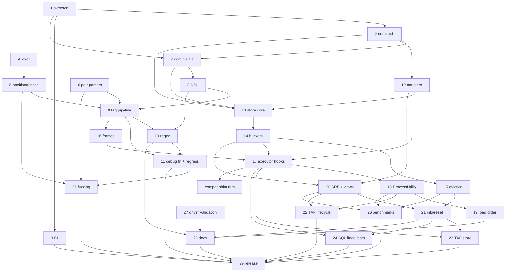

# pg_stat_statement_context — Backlog

This backlog breaks [DESIGN.md](DESIGN.md) (Draft) into concrete, implementable
tasks. Section references (§N) point to DESIGN.md.

## How to read this backlog

**Task IDs** use the format `YYYYMMDD-HHMMSS-N`. The `YYYYMMDD-HHMMSS` part is
the local time at which a batch of tasks was written, and `N` numbers the tasks
in that batch sequentially from 1. Every task in this file shares the prefix
`20261005-091225`. To add tasks, use your own current timestamp as the prefix
and start again at 1, so that people adding tasks at the same time don't create
the same ID. Never renumber or reuse an ID.

**Fields** for each task:

- **Description**: what to build, scoped so that one engineer or agent can
  complete it, with references to DESIGN.md.
- **Acceptance criteria**: brief, testable conditions for done.
- **Depends on**: task IDs that must be finished first, or `none`.
- **Open questions**: undecided design questions that must be answered
  **before** the task can start, or `none`. These cover only things that
  DESIGN.md leaves open, ambiguous, or TBD. Smaller choices that an implementer
  can make on their own, then document and confirm in review, are listed as
  *Design notes* instead and don't block the task.
- **Status**:
  - `ready`: every dependency is done and there are no open questions.
  - `blocked-on-deps`: there are no open questions, but at least one dependency
    is unfinished.
  - `blocked-on-questions`: the task has open questions. This status takes
    precedence when a task also has unfinished dependencies, because the
    questions can be answered now, in parallel with the dependency work.
    Dependencies are still listed in the table.

The backlog has two parts: **v1** (tasks 1–29, plus later additions
20261005-101154-1 and 20261005-103941-1) and the **post-v1 roadmap** (tasks
30, 32–35, 38, 39, 41, 42, 45, and 46, §8). Roadmap tasks 31, 36, 37, 40, 43,
and 44 were dropped on 2026-10-05 as out of scope for a `pg_stat_statements`
companion; they are archived under "Dropped" in BACKLOG-COMPLETE.md. Any
roadmap task that adds SQL objects or columns must ship
an extension upgrade script (for example `--1.0--1.1.sql`) rather than edit the
frozen 1.0 script.

**Scope decision (2026-10-05):** the extension is a companion to
`pg_stat_statements`, not a replacement. Per (queryid × context) it stores only
`calls` and `total_exec_time`; every other statistic comes from pgss via a join
on `(userid, dbid, queryid, toplevel)` (DESIGN.md §5.1, §7).

## Summary

| ID | Title | Depends on | Has open questions | Status |
|----|-------|------------|--------------------|--------|
| 20261007-070036-1 | Scope cardinality caps per (role, database) (security) | none | no | ready |
| 20261007-070036-2 | Apply cardinality caps under the identity that records the tags | 20261007-070036-1 | no | blocked-on-deps |
| 20261005-091225-29 | v1 release readiness | 20261005-091225-3, 20261005-091225-11, 20261005-091225-22, 20261005-091225-23, 20261005-091225-24, 20261005-091225-25, 20261005-091225-26, 20261005-091225-28, 20261005-213120-1, 20261006-010149-1, 20261005-091225-32, 20261007-070036-1 | no | blocked-on-deps |
| 20261006-220356-1 | Flaky TAP 017: utility time parity with pgss under assert builds | none | no | ready |
| 20261005-091225-45 | Roadmap: distribution packaging and provider outreach | 20261005-091225-29 | no | blocked-on-deps |
| 20261005-091225-46 | Roadmap: upstream proposal for a statement-comment hook | 20261005-091225-26, 20261005-091225-29 | no | blocked-on-deps |

### How the DESIGN.md §11 open questions were resolved

All seven §11 questions were answered by the project owner on 2026-10-05.

| §11 question | Resolution | Recorded in task |
|--------------|------------|------------------|
| Q1: record the empty tag set by default? | No: `untagged = skip` is the default | 20261005-091225-29 |
| Q2: `jsonb` vs fixed columns for `tags` | `jsonb` | 20261005-091225-20 |
| Q3: DSL in one GUC vs a `config_file` | GUCs only; `ALTER SYSTEM` + `pg_reload_conf()` from SQL | 20261005-091225-31 (dropped), 20261005-091225-28 |
| Q4: is `utility_textid` worth it? | No; pgss has the same PG14/15 behavior | 20261005-091225-37 (dropped) |
| Q5: `bucket_id` in key vs per-entry bucket ring | Per-entry counter ring | 20261005-091225-13, -14, -15 |
| Q6: error-count dedup rules; cancellations separate? | Moot: error counts dropped | 20261005-091225-40 (dropped) |
| Q7: load-order violation: `WARNING` vs disable utility tracking | `WARNING` only | 20261005-091225-19 |

Other blocking questions came up while decomposing the design. Those on tasks
8, 9, 12, 21, 30, 32, 35, 38, and 41 were answered on 2026-10-05 (see each
task's **Decisions**). No task currently has open questions.

### Dependency overview (v1)

Short labels: `T1` = `20261005-091225-1`, and so on.

`C1` = `20261005-103941-1`. No v1 task has open questions any more (so none is
marked `?`). Every dependency points to a lower-numbered task, or (for `C1`)
to an older task, so the graph is acyclic. 20261005-101154-1 has no
dependencies and is not shown.

---

## v1 tasks

### 20261005-091225-29: v1 release readiness

**Description:** Prepare and cut the v1.0 release:
- Confirm the defaults (including `untagged = skip`), then freeze `--1.0.sql`. Later changes go into upgrade scripts.
- Verify `make install` from a clean checkout on every CI cell, including the assert and Valgrind jobs.
- Check that the benchmark numbers are published.
- Check that DESIGN.md §11 records how each question was resolved (done on 2026-10-05) and that the release notes summarize them.
- Add a CHANGELOG, tag `v1.0.0`, and create a GitHub release.

**Acceptance criteria:**
- The checklist is complete, CI is green, the tag and release exist, and the README install steps work from a clean checkout.

**Decisions:**
- 2026-10-05 (§11 Q1): Untagged statements are **skipped** by default (`untagged = skip`); `untagged = record` stays available. The sizing guidance assumes this default.
- 2026-10-06 (Q1): Finish 20261005-213120-1 and 20261006-010149-1 before freezing `--1.0.sql`.
- 2026-10-06 (Q2): Moot; 20261006-043919-1 landed. 20261006-075124-1 is not a v1 blocker.
- 2026-10-06 (Q3): The **owner** pushes, tags `v1.0.0` and creates the GitHub release. The agent prepares everything locally (CHANGELOG, release notes, freeze) and stops before pushing.
- 2026-10-06: v1.0 ships the roadmap features already built: appname, normalize, activity view, tags_override, and per-key cardinality caps (20261005-091225-32).
- 2026-10-06 (owner, after -33/-34/-35 landed): **fold 1.1 into 1.0.** 1.0 was never released, so the first release is HEAD as v1.0.0: `--1.0--1.1.sql` (exemplars) is merged into `sql/pg_stat_statement_context--1.0.sql`, the upgrade script is deleted, `default_version = '1.0'`, and `sql/frozen.sha256` holds the new checksum. The freeze policy is unchanged: from v1.0.0 on, SQL changes go into upgrade scripts. v1.0.0 also ships the reclaim worker (-34), persistence (`save`, -35) and exemplars (-33).

**Progress (2026-10-06, agent):** everything up to the owner's steps is done:
- `untagged` defaults to `skip` (`src/guc.c`). `--1.0.sql` is frozen (header comment, `sql/frozen.sha256`, `scripts/check-frozen-sql.sh` in CI and `docker/run-tests.sh`; DESIGN.md §7).
- `CHANGELOG.md` and `docs/release-notes/v1.0.0.md` added; the notes summarize the §11 resolutions. §11 is accurate. Benchmark numbers are committed in `docs/benchmarks.md`.
- Local matrix in Docker: PGDG 14–18, `--assert` 14–18 and `--valgrind 18` all pass; README install + quick start verbatim from a fresh `git clone` on PG 14 and 18.
- Fixed on the way: `docker/Dockerfile.source` passed the release as `ARG PG_VERSION`, which the base image's `ENV PG_VERSION` overrides under the legacy builder (tarball 404); renamed to `PG_SOURCE_VERSION`.
- (Superseded by the progress note below: -33, -34 and -35 landed afterwards.)

**Progress (2026-10-06 evening, agent, after the 1.1 fold; commit 6264c97):**
- 1.1 folded into 1.0 per the owner's decision above: `--1.0.sql` defines the exemplar columns, `--1.0--1.1.sql` and the `_1_1` C symbols are gone, `default_version = '1.0'`, `sql/frozen.sha256` re-recorded (`scripts/check-frozen-sql.sh` has no re-record mode, so the manifest line was edited). A catalog comparison on PG 18 of old 1.0 + upgrade vs. the folded script showed identical signatures, volatility/parallel/strict labels, ACLs and view definitions (only the C symbol names differ).
- CHANGELOG `[1.0.0]` and `docs/release-notes/v1.0.0.md` now include the reclaim worker, `save` and exemplars; they are off the post-v1 list. `save` is now documented in `docs/configuration.md`; limitations/sql-interface/integrations no longer say statistics are lost on every restart. DESIGN.md §6.13, §7, §8, §9 updated; §11 unchanged and accurate.
- Matrix from a fresh `git clone` of 6264c97 (`scripts/docker-test.sh`): PGDG 14.24, 15.19, 16.15, 17.11, 18.6 PASS; `--assert` 14.24, 15.19, 17.11, 18.6 PASS; `--assert` 16.15 FAIL once (timing flake in `017_lifecycle.pl`: a `RELEASE SAVEPOINT` took 5.6 ms in our hook vs 0.11 ms in pgss's, over the 2 ms slack; unrelated to the fold), PASS on rerun, tracked as 20261006-220356-1; `--valgrind 18` PASS (no Valgrind errors in 13 + 33 processes). Unit tests (ASan/UBSan), version-guard and frozen-SQL checks (+ self-tests) pass in every cell and on the host. `fuzz/run-libfuzzer.sh -t 15`: all 4 targets ok.
- README install + quick start verbatim (code blocks extracted from the committed README) from the fresh clone on PG 14 and 18: `make`, `make install`, both `CREATE EXTENSION`s, the quick-start output matches (2 rows, calls 2 and 1), `_extract()` returns the documented tags, extversion 1.0, no server-log warnings.
- Not run: `scripts/test-integrations.sh` (pulling the third-party images failed in this environment: Docker credential helper error).
- Benchmarks in `docs/benchmarks.md` were measured at 22f9e0f, before -33/-34/-35 (all off by default or off the hot path); not re-run.
- **Remaining (owner):** push `main`, wait for CI to be green, tag `v1.0.0`, create the GitHub release from `docs/release-notes/v1.0.0.md`, then run `scripts/backlog-complete.py 20261005-091225-29`.

**Depends on:** 20261005-091225-3, 20261005-091225-11, 20261005-091225-22, 20261005-091225-23, 20261005-091225-24, 20261005-091225-25, 20261005-091225-26, 20261005-091225-28, 20261005-213120-1, 20261006-010149-1, 20261005-091225-32, 20261007-070036-1 (security fix, must land before the tag; the release matrix must be rerun after it)
**Open questions:** none
**Status:** blocked-on-deps

### 20261007-070036-1: Scope cardinality caps per (role, database) (security)

**Description:** Found by the 2026-10-07 security reviews (GPT 6 Astra finding 1, MEDIUM; Opus 5.5 P1, LOW). The cardinality-cap table (`src/cardcap.c`, §6.1) is server-wide: `cap_check()` hashes only (key, value). Two problems follow:
- **Membership oracle.** Once a key is at its cap, a value already admitted by another role stays a string while an unseen value becomes JSON `null`. Any role can therefore send a candidate value in its own statement comment and read its own row (the activity view, or the store) to learn whether another role or database already sent that value. This breaks §6.11's promise that tag visibility is "at least as strict as pgss".
- **Poisoning.** Any role can use up a key's cap, so every other role's values become `null` until a superuser runs `_reset()`.

Fix (decided by the owner 2026-10-07): add a postmaster GUC `pg_stat_statement_context.cardinality_cap_scope`, an enum with values `'server' | 'database' | 'role'` and default **`'role'`**:
- `role` mixes (userid, dbid) into the key and value hashes, so both the admitted set and the per-key counts are kept per (role, database). This matches pgss's entry key.
- `database` mixes only dbid.
- `server` keeps today's behaviour.

Use the same userid/dbid the store records for the entry. The table size stays `cardinality_cap_slots` (a single shared global limit, like `pgss.max`), so the layout of shared memory does not change. Scoping only makes the table fill faster, so document that busy multi-tenant servers may need more slots. When the table is full, values become `null`, as now. The `--1.0` SQL does not change. Land this before the v1.0.0 tag: update DESIGN.md (§6.1 and the GUC table, plus a §6.11 note), README, CHANGELOG and `docs/release-notes/v1.0.0.md`.

**Acceptance criteria:**
- A TAP test with two roles and `cardinality_cap = 1`, under the default scope: role B's first value is kept (not `null`) after role A filled the cap, and B can't tell whether A's value was admitted (the same candidate value gives the same result whether or not A sent it).
- Same isolation across two databases for the same role.
- With `cardinality_cap_scope = 'database'`, two roles in one database share the cap, and two databases do not.
- With `'server'`, the current server-wide behaviour, including the existing cap tests, is unchanged.
- The GUC is a postmaster GUC, rejects invalid values, and shows in `pg_settings`.
- The full suite passes on PG 14–18, and `scripts/check-frozen-sql.sh` passes.

**Depends on:** none
**Open questions:** none (scope toggle and default `role` decided 2026-10-07)
**Status:** ready

### 20261007-070036-2: Apply cardinality caps under the identity that records the tags

**Description:** Found by the round-1 review of 20261007-070036-1 (gpt-6.1-sol). Caps are applied under `GetUserId()`/`MyDatabaseId` at extraction (`src/extract.c`), but the identity that records the tags can differ:
- An executor frame refreshes its userid at `ExecutorEnd` (`src/executor.c` ~174-179). A cursor opened under role A and closed under role B is therefore capped against A's scope and recorded under B. B can end up with more distinct values than its cap (e.g. cap 1: `a1` admitted for A, `b1` for B; the cursor records `a1` under B).
- A `SECURITY DEFINER` child inherits the caller's already-capped tags without calling the cap hook (`src/context.c` ~185-205) and records them under the definer's userid.
- With `nested_tags = scan`, a cursor created by a definer and then fetched or closed by the caller can show the definer's cap decisions in the caller's rows.

Each case needs membership in both roles, or a function whose author controls the tag text. So the impact is limited to inaccurate cap accounting plus a narrow decision leak between roles that already share a trust boundary. It is documented as a residual in DESIGN.md §6.1/§6.11. Fix: keep the uncapped normalized tags, and the scope they were capped under, on the frame. Re-apply the caps for the receiving identity when tags cross roles (inheritance, activity publication, recording). Keep the existing pgss-compatible end-time userid semantics.

**Acceptance criteria:**
- Regression tests for a cursor that changes role (opened under A, closed under B, cap 1) and for `SECURITY DEFINER` inheritance and returned cursors. Every recorded tag set obeys the cap of the identity it is recorded under.
- No measurable hot-path regression when roles don't change (one identity comparison).
- Full suite passes on PG 14-18.

**Depends on:** 20261007-070036-1
**Open questions:** none
**Status:** blocked-on-deps

### 20261006-220356-1: Flaky TAP 017: utility time parity with pgss under assert builds

**Description:** Found during 20261005-091225-29 (release matrix, `scripts/docker-test.sh --assert 16`, PG 16.15). `test/t/017_lifecycle.pl` check 80, "track = all, track_utility = on (both): per-(userid, dbid, queryid, toplevel) calls and total_exec_time equal pgss's", failed once: `utility time 5.647375 vs pgss's 0.108292 (allowed difference 2.00108292)` for `RELEASE SAVEPOINT s2` (ours=1, pgss=1). It passed on rerun and in every other cell. Our `ProcessUtility` hook wraps pgss's, so a scheduling stall between the two timers lands in our time only; the 2 ms per-call slack (`PSSC_TEST_UTILITY_SLACK_MS`) is not enough on a loaded laptop Docker VM. Make the check robust without hiding real timing bugs (e.g. retry the workload once on a utility-time-only mismatch, or compare against a bound that tolerates rare single-call stalls while still failing on systematic differences). The failing log was `tmp/release-clone/tmp/logs/assert-16-flake.log` (scratch, may be gone).

**Acceptance criteria:**
- The check still fails if our utility timing is systematically wrong (demonstrated with a deliberate fault in a scratch copy).
- 017 passes 10 of 10 runs of `--assert 16` (or under an equivalent documented load recipe).

**Depends on:** none
**Open questions:** none
**Status:** ready

---

## Post-v1 roadmap tasks (§8)

### 20261005-091225-45: Roadmap: distribution packaging and provider outreach

**Description:** Package and distribute the extension (§8 v3):
- PGXN `META.json` and an upload
- PGDG apt/yum packaging requests
- a Homebrew formula
- Docker images based on the official postgres images

Also contact the managed providers (RDS, Cloud SQL, Azure) about adding the extension to their allowlists (§6.12).

**Acceptance criteria:**
- Each package installs, and `CREATE EXTENSION` works.
- The outreach is logged, with contacts and status.

**Depends on:** 20261005-091225-29
**Open questions:** none
**Status:** blocked-on-deps

### 20261005-091225-46: Roadmap: upstream proposal for a statement-comment hook

**Description:** Write and send a pgsql-hackers proposal for a core hook or field for statement comments, or a query-tag mechanism, that would benefit pgss and similar extensions (§8 v3). Use the benchmark data and the limitations (§6.2, §6.3, §6.6) as motivation.

**Acceptance criteria:**
- The proposal is posted, and the thread link and outcome are recorded in the repository.

**Depends on:** 20261005-091225-26, 20261005-091225-29
**Open questions:** none
**Status:** blocked-on-deps
