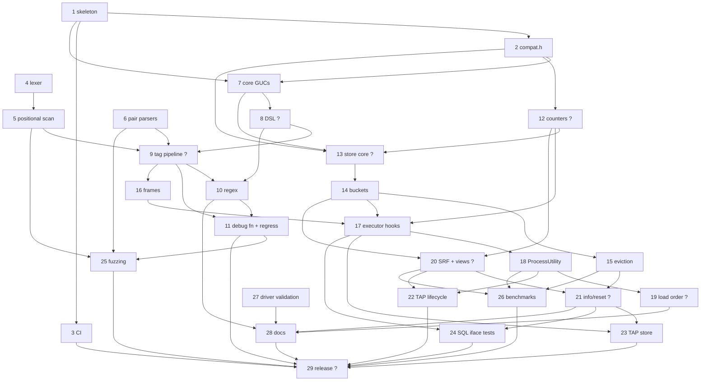

# pg_stat_statement_context — Backlog

This backlog breaks [DESIGN.md](DESIGN.md) (Draft) into concrete, implementable
tasks. Section references (§N) point to DESIGN.md.

## How to read this backlog

**Task IDs** use the format `YYYYMMDD-HHMMSS-N`. The `YYYYMMDD-HHMMSS` part is
the local time at which a batch of tasks was written, and `N` numbers the tasks
in that batch sequentially from 1. Every task in this file shares the prefix
`20261005-091225`. To add tasks, use your own current timestamp as the prefix
and start again at 1, so that people adding tasks at the same time don't create
the same ID. Never renumber or reuse an ID.

**Fields** for each task:

- **Description**: what to build, scoped so that one engineer or agent can
  complete it, with references to DESIGN.md.
- **Acceptance criteria**: brief, testable conditions for done.
- **Depends on**: task IDs that must be finished first, or `none`.
- **Open questions**: undecided design questions that must be answered
  **before** the task can start, or `none`. These cover only things that
  DESIGN.md leaves open, ambiguous, or TBD. Smaller choices that an implementer
  can make on their own, then document and confirm in review, are listed as
  *Design notes* instead and don't block the task.
- **Status**:
  - `ready`: every dependency is done and there are no open questions.
  - `blocked-on-deps`: there are no open questions, but at least one dependency
    is unfinished.
  - `blocked-on-questions`: the task has open questions. This status takes
    precedence when a task also has unfinished dependencies, because the
    questions can be answered now, in parallel with the dependency work.
    Dependencies are still listed in the table.

The backlog has two parts: **v1** (tasks 1–29) and the **post-v1 roadmap**
(tasks 30–46, §8). Any roadmap task that adds SQL objects or columns must ship
an extension upgrade script (for example `--1.0--1.1.sql`) rather than edit the
frozen 1.0 script.

## Summary

| ID | Title | Depends on | Has open questions | Status |
|----|-------|------------|--------------------|--------|
| 20261005-091225-1 | Project skeleton and PGXS build | none | no | ready |
| 20261005-091225-2 | `compat.h` PG14–18 version shims | 20261005-091225-1 | no | blocked-on-deps |
| 20261005-091225-3 | CI matrix (PG14–18 × Linux/macOS, assert, Valgrind) | 20261005-091225-1 | no | blocked-on-deps |
| 20261005-091225-4 | Comment scanner: forward lexer | none | no | ready |
| 20261005-091225-5 | Statement ranges and positional (windowed) scanning | 20261005-091225-4 | no | blocked-on-deps |
| 20261005-091225-6 | SQLCommenter and marginalia pair parsers | none | no | ready |
| 20261005-091225-7 | Core GUCs | 20261005-091225-1, 20261005-091225-2 | no | blocked-on-deps |
| 20261005-091225-8 | Extractor DSL parser and GUC check/assign hooks | 20261005-091225-7 | yes | blocked-on-questions |
| 20261005-091225-9 | Tag-set canonicalization pipeline and extractor chain | 20261005-091225-5, 20261005-091225-6, 20261005-091225-8 | yes | blocked-on-questions |
| 20261005-091225-10 | Regex extractor runtime | 20261005-091225-8, 20261005-091225-9 | no | blocked-on-deps |
| 20261005-091225-11 | Debug extract function and scanner/extractor regression suite | 20261005-091225-9, 20261005-091225-10 | no | blocked-on-deps |
| 20261005-091225-12 | Counter set, accumulation, and bucket-merge math | 20261005-091225-2 | yes | blocked-on-questions |
| 20261005-091225-13 | Shared store core (shmem, HTAB, key, locking) | 20261005-091225-2, 20261005-091225-7, 20261005-091225-12 | yes | blocked-on-questions |
| 20261005-091225-14 | Time-bucket ring and lazy rollover | 20261005-091225-13 | no | blocked-on-deps |
| 20261005-091225-15 | Eviction under pressure | 20261005-091225-14 | no | blocked-on-deps |
| 20261005-091225-16 | Execution frames and active-frame tracking | 20261005-091225-9 | no | blocked-on-deps |
| 20261005-091225-17 | Executor hooks and recording | 20261005-091225-12, 20261005-091225-14, 20261005-091225-16 | no | blocked-on-deps |
| 20261005-091225-18 | `ProcessUtility` hook | 20261005-091225-17 | no | blocked-on-deps |
| 20261005-091225-19 | `shared_preload_libraries` load-order detection and policy | 20261005-091225-18 | yes | blocked-on-questions |
| 20261005-091225-20 | Stats SRF and views | 20261005-091225-12, 20261005-091225-14 | yes | blocked-on-questions |
| 20261005-091225-21 | `_info()` and `_reset()` functions | 20261005-091225-15, 20261005-091225-20 | yes | blocked-on-questions |
| 20261005-091225-22 | TAP tests: execution lifecycle and pgss parity | 20261005-091225-18, 20261005-091225-20 | no | blocked-on-deps |
| 20261005-091225-23 | TAP tests: store, buckets, eviction, and reconfiguration | 20261005-091225-17, 20261005-091225-21 | no | blocked-on-deps |
| 20261005-091225-24 | Tests: SQL interface, visibility, encodings, merge math | 20261005-091225-17, 20261005-091225-21 | no | blocked-on-deps |
| 20261005-091225-25 | Fuzzing harnesses | 20261005-091225-5, 20261005-091225-6, 20261005-091225-11 | no | blocked-on-deps |
| 20261005-091225-26 | Overhead and latency benchmarks | 20261005-091225-15, 20261005-091225-18, 20261005-091225-20 | no | blocked-on-deps |
| 20261005-091225-27 | Validate prepared-statement behavior of target drivers | none | no | ready |
| 20261005-091225-28 | User documentation | 20261005-091225-10, 20261005-091225-19, 20261005-091225-21, 20261005-091225-27 | no | blocked-on-deps |
| 20261005-091225-29 | v1 release readiness | 20261005-091225-3, 20261005-091225-11, 20261005-091225-22, 20261005-091225-23, 20261005-091225-24, 20261005-091225-25, 20261005-091225-26, 20261005-091225-28 | yes | blocked-on-questions |
| 20261005-091225-30 | Roadmap: `tags_override` session/transaction context | 20261005-091225-18, 20261005-091225-27 | yes | blocked-on-questions |
| 20261005-091225-31 | Roadmap: extractor config file (conditional) | 20261005-091225-8 | yes | blocked-on-questions |
| 20261005-091225-32 | Roadmap: per-key cardinality caps (`<other>`) | 20261005-091225-17, 20261005-091225-21 | yes | blocked-on-questions |
| 20261005-091225-33 | Roadmap: exemplars for excluded high-cardinality keys | 20261005-091225-17, 20261005-091225-20 | yes | blocked-on-questions |
| 20261005-091225-34 | Roadmap: background worker for bucket rollover | 20261005-091225-15 | no | blocked-on-deps |
| 20261005-091225-35 | Roadmap: persist stats across clean restarts | 20261005-091225-15, 20261005-091225-21 | yes | blocked-on-questions |
| 20261005-091225-36 | Roadmap: `track_planning` (planning time) | 20261005-091225-17, 20261005-091225-20 | no | blocked-on-deps |
| 20261005-091225-37 | Roadmap: `utility_textid` column for PG14/15 | 20261005-091225-4, 20261005-091225-18, 20261005-091225-20 | yes | blocked-on-questions |
| 20261005-091225-38 | Roadmap: context from `application_name` | 20261005-091225-9, 20261005-091225-17 | yes | blocked-on-questions |
| 20261005-091225-39 | Roadmap: `pg_stat_statement_context_activity` view | 20261005-091225-18, 20261005-091225-20 | no | blocked-on-deps |
| 20261005-091225-40 | Roadmap: error and cancellation counts per tag set | 20261005-091225-18, 20261005-091225-20 | yes | blocked-on-questions |
| 20261005-091225-41 | Roadmap: tag value normalization rules | 20261005-091225-9, 20261005-091225-10 | yes | blocked-on-questions |
| 20261005-091225-42 | Roadmap: exporter recipes and Grafana dashboard | 20261005-091225-28 | no | blocked-on-deps |
| 20261005-091225-43 | Roadmap: wait-event sampling attributed to tags | 20261005-091225-39 | yes | blocked-on-questions |
| 20261005-091225-44 | Roadmap: OS-level CPU/I/O (`getrusage`) per tag set | 20261005-091225-18, 20261005-091225-20 | no | blocked-on-deps |
| 20261005-091225-45 | Roadmap: distribution packaging and provider outreach | 20261005-091225-29 | no | blocked-on-deps |
| 20261005-091225-46 | Roadmap: upstream proposal for a statement-comment hook | 20261005-091225-26, 20261005-091225-29 | no | blocked-on-deps |

### Where the DESIGN.md §11 open questions are tracked

| §11 question | Blocks task |
|--------------|-------------|
| Q1: record the empty tag set by default? | 20261005-091225-29 (the `untagged` default is `record` per §4.1 until confirmed) |
| Q2: `jsonb` vs fixed columns for `tags` | 20261005-091225-20 |
| Q3: DSL in one GUC vs a `config_file` | 20261005-091225-31 (v1 proceeds with the GUC per §4) |
| Q4: is `utility_textid` worth it? | 20261005-091225-37 |
| Q5: `bucket_id` in key vs per-entry bucket ring | 20261005-091225-13 |
| Q6: error-count dedup rules; cancellations separate? | 20261005-091225-40 |
| Q7: load-order violation: `WARNING` vs disable utility tracking | 20261005-091225-19 |

Other blocking questions came up while decomposing the design. They are
attached to tasks 8, 9, 12, 21, 30, 32, 33, 35, 38, 41, and 43.

### Dependency overview (v1)

Short labels: `T1` = `20261005-091225-1`, and so on.

`?` marks a task with open questions. Every dependency points to a
lower-numbered task, so the graph is acyclic.

---

## v1 tasks

### 20261005-091225-1: Project skeleton and PGXS build

**Description:** Create the repository layout from §10.
- A PGXS `Makefile` (`MODULE_big`, `OBJS` for `src/*.c`, `EXTENSION`, `DATA`, `REGRESS` with `--inputdir=test`, `TAP_TESTS`, and a temp config that preloads the library).
- `pg_stat_statement_context.control` (`default_version = '1.0'`) and a stub `sql/pg_stat_statement_context--1.0.sql`.
- `src/pg_stat_statement_context.c` with `PG_MODULE_MAGIC` and a `_PG_init` that does nothing unless `process_shared_preload_libraries_in_progress` (§6.12) and that calls `EnableQueryId()` (§2).
- Empty stubs for `guc.c`, `scan.c`, `extract.c`, `context.c`, and `store.c`.
- The `test/{sql,expected,t}` directories, a trivial smoke test, and `.gitignore`.

`meson.build` is optional (§10 lists "Makefile / meson.build"), and PGXS is the required path.

**Acceptance criteria:**
- `make && make install` succeeds against at least one of PG14–18 locally. Task 20261005-091225-3 checks all of them.
- With the library preloaded, the server starts cleanly and `CREATE EXTENSION pg_stat_statement_context` works.
- Loading the library without preloading it doesn't crash.
- `make installcheck` runs the smoke test and passes.

**Depends on:** none
**Open questions:** none
**Status:** ready

### 20261005-091225-2: `compat.h` PG14–18 version shims

**Description:** Collect the version differences from §6.10 in `src/compat.h`:
- the `ExecutorRun` signature (`execute_once` was removed in PG18)
- the `ProcessUtility` signature
- shared-memory requests: `RequestAddinShmemSpace`/`RequestNamedLWLockTranche` in `_PG_init` on PG14, `shmem_request_hook` on PG15+
- a helper that allocates GUC `extra` with `malloc` on PG14/15 (freed with `free()`) and `guc_malloc` on PG16+ (§4.2)
- regex allocation context handling (PG14/15 `malloc`, PG16+ `palloc`)
- the rows source: `es_processed` on PG14/15, `es_total_processed` on PG16+
- availability macros for buffer, WAL, I/O-timing, and JIT fields
- `MarkGUCPrefixReserved` (PG15+) vs `EmitWarningsOnPlaceholders` (PG14)
- `InitMaterializedSRF` (PG15+) vs a hand-rolled materialize mode on PG14

Other files should put version-dependent code behind these macros or helpers rather than scattering `PG_VERSION_NUM` checks.

**Acceptance criteria:**
- The header compiles warning-free with `-Wall` on PG14, 15, 16, 17, and 18.
- Each shim has a one-line comment naming the versions it covers.
- No `PG_VERSION_NUM` checks appear outside `compat.h` unless a comment justifies them.

**Depends on:** 20261005-091225-1
**Open questions:** none
**Status:** blocked-on-deps

### 20261005-091225-3: CI matrix (PG14–18 × Linux/macOS, assert, Valgrind)

**Description:** Add a GitHub Actions workflow (§9 CI matrix):
- Build and run `make installcheck` plus the TAP tests for PG14–18 on Linux (PGDG packages) and macOS (Homebrew or source build).
- Add a Linux job that builds PostgreSQL with `--enable-cassert`/`-DUSE_ASSERT_CHECKING` and `--enable-tap-tests`.
- Add a Linux job that runs the regression suite under Valgrind, using PostgreSQL's `valgrind.supp`.
- Cache source builds.
- Make the TAP harness work on both module namespaces: `PostgresNode`/`TestLib` on PG14 and `PostgreSQL::Test::*` on PG15+. This can be a small compatibility wrapper or a documented PG14 skip policy.

**Acceptance criteria:**
- The workflow runs on pushes and pull requests.
- Every cell is green on the skeleton.
- A deliberately failing test fails its job.
- The Valgrind job reports no errors.

**Depends on:** 20261005-091225-1
**Open questions:** none
**Status:** blocked-on-deps

### 20261005-091225-4: Comment scanner: forward lexer

**Description:** Implement `src/scan.c`/`scan.h` (§3.1 item 1). This is a backend-independent, single-pass state machine with no `palloc` and no `elog`. It reports comment spans in a byte range `[start, end)` of a `const char *`, following `scan.l`:
- `'strings'` with `''` doubling, and backslash escapes when `standard_conforming_strings = off`. The setting is passed in as a parameter (§6.2).
- `E''` strings (always backslash-escaped), `U&''` strings, and `"quoted identifiers"`, including `U&""`.
- `$tag$...$tag$` dollar quotes, using `scan.l`'s tag-character rules, and `$1` parameters. A `$` inside an identifier, as in `a$b$`, does not start a dollar quote.
- Nested `/* /* */ */` comments and `--` line comments.
- An unterminated comment or string produces no span for the incomplete comment.

Output goes to a caller-provided fixed array of `(offset, len)` spans, capped at 16 comments (§6.11), with a flag that reports truncation. The total size of examined comments is capped by a parameter (`scan_window`). Also expose a helper that reports whether a byte range contains only `;`, whitespace, and comments. Task 20261005-091225-5 uses it for the trailing-footer rule (§6.5).

*Design note:* server encodings are ASCII-safe, so lexing byte by byte is correct for multibyte text.

**Acceptance criteria:**
- A small standalone C test driver (no server; it can later seed the fuzz corpus) covers every construct listed above, plus multibyte UTF-8 and unterminated constructs. All cases pass.
- The scanner is O(n), performs no heap allocation, and never reads outside `[start, end)`.

**Depends on:** none
**Open questions:** none
**Status:** ready

### 20261005-091225-5: Statement ranges and positional (windowed) scanning

**Description:** Build the statement-level scanning API on top of the lexer (§6.2, §6.5).

Resolve the statement range from `stmt_location`/`stmt_len`:
- A location of `-1` means the whole string, as in `CleanQuerytext`.
- A length of `0` means to the end of the string. This is the only case that needs `strlen`.

Choose the scan mode:
- If the range fits within `scan_window`, lex it exactly from the front.
- If it is longer:
  - `prepend` lexes only the first `scan_window` bytes.
  - `append` trims whitespace and `;` within the tail window only, requires a closing `*/`, and walks backwards to the matching `/*` while tracking nesting depth. A trailing `--` comment, or a comment that crosses the window start, yields nothing. Results from this path are flagged *heuristic*, which feeds `_info().heuristic_scans`.
  - `any` does a full forward scan.

Provide the trailing-footer fallback separately. It returns comment spans after the statement's range only when the rest of the string contains nothing except `;`, whitespace, and comments. The caller uses these spans only if the statement's own range produced no tags. The API never returns half a comment.

**Acceptance criteria:**
- Unit tests cover:
  - `SELECT 1 /*a*/; SELECT 2 /*b*/`: each statement gets only its own comment.
  - `SELECT 1; SELECT 2; /*controller:x*/`: only the last statement gets the footer.
  - statements longer than `scan_window` in `append`, `prepend`, and `any` modes
  - a string literal that ends in `*/` on the tail path, which must be flagged heuristic
  - a comment that crosses the window start, which yields nothing
  - `stmt_len = 0` and `stmt_location = -1`

**Depends on:** 20261005-091225-4
**Open questions:** none
**Status:** blocked-on-deps

### 20261005-091225-6: SQLCommenter and marginalia pair parsers

**Description:** Write pure-C parsers with no backend dependencies (§4.2, §9 fuzzing) that turn one comment body into raw `(key, value)` pairs:
- **SQLCommenter:** `key='value',key2='value2'`. Values are URL-decoded when `url_decode=on` (the default), and `\'` is unescaped.
- **marginalia:** pairs are split on `pair_sep` (default `,`), and each pair is split on the **first** `kv_sep` (default `:`), so `line:app/models/u.rb:12` keeps its colons.

Decoded output goes into a caller-provided bounded buffer. Decoded NUL bytes (`%00`) are kept and flagged so the pipeline can reject them (§6.11). Malformed pairs are skipped and counted, and the parsers never fail.

*Design note:* §4.2 doesn't specify whitespace handling. Proposed default: trim ASCII whitespace around the comment body and around each pair, then document it.

**Acceptance criteria:**
- Unit tests cover:
  - the examples in §4.2
  - values that contain colons
  - escaped quotes
  - valid and invalid `%` escapes, including `%00`
  - empty keys and values
  - custom `kv_sep`/`pair_sep`
  - `url_decode=off`
- The parsers allocate nothing beyond the caller buffer.
- Each parser has an entry point suitable for libFuzzer.

**Depends on:** none
**Open questions:** none
**Status:** ready

### 20261005-091225-7: Core GUCs

**Description:** In `src/guc.c`, define every GUC in §4.1 with its default, context, and unit:
- `superuser` maps to `PGC_SUSET`, `postmaster` to `PGC_POSTMASTER`, and `sighup` to `PGC_SIGHUP`.
- `bucket_interval` uses seconds as its unit, and `scan_window` uses bytes.
- `track`, `nested_tags`, and `untagged` are enum GUCs.
- Numeric GUCs get sane bounds, for example `bucket_count >= 1`, keys up to 63 bytes, and a minimum for `max_tagset_bytes`.
- `tags` and `exclude_tags` are parsed in a `check_hook` into a flat `extra` blob using the compat allocator, with `'*'` handled. The `assign_hook` installs the pointer and bumps the backend-local config generation, and it can't fail (§3.1 item 6).
- Postmaster GUCs are defined only during `shared_preload_libraries` loading, and the prefix is reserved.

**Acceptance criteria:**
- Every GUC appears in `pg_settings` with a description.
- A non-superuser `SET` of a `superuser` GUC fails.
- `ALTER SYSTEM` plus a reload changes `sighup` GUCs, and postmaster GUCs need a restart.
- Invalid values are rejected with a clear error, and the previous value stays active.

**Depends on:** 20261005-091225-1, 20261005-091225-2
**Open questions:** none
**Status:** blocked-on-deps

### 20261005-091225-8: Extractor DSL parser and GUC check/assign hooks

**Description:** Implement the `pg_stat_statement_context.extractors` grammar from §4.2 in the `check_hook`.

Accepted parameters:
- Extractor names: `sqlcommenter`, `marginalia`, `regex`.
- Common parameters: `position`, `keys` (`|`-separated), `rename` (`old:new|...`), `merge`.
- Format-specific parameters: `url_decode`; `kv_sep` and `pair_sep`; `pattern` and `keys` for `regex`.
- Values may be quoted, with `''` escaping, as in the regex example.

Reject the following with `GUC_check_errdetail` and keep the previous config:
- unknown names or parameters
- duplicate parameters
- invalid values

Validate `regex` extractors by test-compiling each pattern with `pg_regcomp`, using `REG_ADVANCED` and `C_COLLATION_OID`, then freeing it with `pg_regfree`. Reject a pattern when any of these is true:
- it is longer than 1 kB
- it uses back-references (`re_info & REG_UBACKREF`)
- it has more than `max_tags` capture groups

Return the parsed form as one flat, pointer-free blob (offsets, not pointers) allocated through the compat helper. The `assign_hook` only stores it and bumps the generation.

*Design note:* the number of regex `keys` should equal the number of capture groups, and a mismatch is an error.

**Acceptance criteria:**
- Every example in §4.2 parses.
- Each class of malformed input is rejected with a specific message, and the old config survives a bad `SIGHUP`.
- The blob contains no pointers and is freed correctly by guc.c on PG14/15 and PG16+, with no leak under Valgrind.

**Depends on:** 20261005-091225-7
**Open questions:**
- What is the default `position` when it is omitted, for example in the default `'sqlcommenter, marginalia'`? §4.2 never says. This matters for overhead on long statements, because `any` does a full scan (§6.2).

**Status:** blocked-on-questions

### 20261005-091225-9: Tag-set canonicalization pipeline and extractor chain

**Description:** In `src/extract.c`, turn `(sourceText, stmt range, config blob, database encoding, standard_conforming_strings)` into a canonical tag set (§3.1 item 2, §4.2, §6.11):

1. For each extractor, scan with its `position` (task 20261005-091225-5) and parse its comments (task 20261005-091225-6, or task 20261005-091225-10 for `regex`).
2. Run every pair through the §6.11 order:
   1. decode
   2. reject values that contain NUL or fail `pg_verify_mbstr`
   3. apply `rename`
   4. apply the per-extractor `keys`
   5. apply the global allowlist, or the denylist when `tags = '*'`
   6. drop keys longer than 63 bytes
   7. truncate values to `max_tag_value_len` with `pg_mbcliplen`
3. Combine extractors: the first one that produces at least one tag wins, unless `merge=on`.
4. Sort the tags by key and serialize them as `k\0v\0...` within `max_tagset_bytes`. Tags that don't fit are dropped in allowlist order. Compute `tags_hash`.
5. Apply the trailing-footer fallback (§6.5) when the statement's own range produced no tags.

Count invalid tags, dropped tags, and heuristic scans in a backend-local stats struct, which the recording path flushes later. No input may raise an error. All work happens before any lock, in a short-lived memory context.

*Design notes* (propose and document; non-blocking):
- With `merge=on`, the earlier extractor wins on a duplicate key.
- When `tags='*'`, overflow tags are dropped in reverse sorted-key order.
- With `position=any`, every comment is parsed, and the first occurrence of a key wins.

**Acceptance criteria:**
- The same tags in a different order produce byte-identical output and hash.
- The serialized size never exceeds `max_tagset_bytes`.
- Malformed input never raises an error.
- Each §6.11 step is covered by the regression suite in task 20261005-091225-11.

**Depends on:** 20261005-091225-5, 20261005-091225-6, 20261005-091225-8
**Open questions:**
- Does a per-extractor `keys` allowlist match the original key names (before `rename`) or the renamed ones? §6.11 fixes the order only for the global allowlist ("rename, then apply the allowlist"), and §4.2 calls `keys` a per-extractor allowlist without placing it in that order.

**Status:** blocked-on-questions

### 20261005-091225-10: Regex extractor runtime

**Description:** Implement the runtime half of the `regex` extractor (§4.2):
- Each backend compiles patterns lazily, on first use after a config-generation change, into a private memory context that it owns, and frees the old ones with `pg_regfree`.
- Patterns use `REG_ADVANCED` and `C_COLLATION_OID`, and are applied **only to comment text**, honoring `position`.
- Comment bytes are converted to `pg_wchar` before matching, and capture offsets are mapped back to byte offsets. Capture group *n* maps to key *n*.
- Raw pairs go into the pipeline from task 20261005-091225-9.
- If lazy compilation fails (for example, out of memory), the extractor is disabled for that backend and the failure is counted. The statement never fails.

**Acceptance criteria:**
- The `svc=(\w+)\s+op=(\w+)` example from §4.2 extracts `service` and `operation`.
- Captures in multibyte comments map to the correct bytes.
- A config reload recompiles the patterns and frees the old ones, with no leak under Valgrind.
- An injected compile failure disables only that extractor, increments a counter, and lets the statement succeed.

**Depends on:** 20261005-091225-8, 20261005-091225-9
**Open questions:** none
**Status:** blocked-on-deps

### 20261005-091225-11: Debug extract function and scanner/extractor regression suite

**Description:** Add a debug SQL function such as `pg_stat_statement_context_extract(query text, stmt_location int DEFAULT -1, stmt_len int DEFAULT 0) RETURNS jsonb` (§9). It runs the full extraction pipeline with the current GUC config and reports whether the heuristic path was used.

Write `pg_regress` tests (`test/sql`, `test/expected`) for every item in the first bullet of §9:
- nested comments, dollar quotes, and `$` inside identifiers
- `E''` and `U&''` strings, and `standard_conforming_strings = off`
- unterminated comments and multibyte text
- multi-statement ranges and trailing footers
- each extractor format
- DSL errors and regex errors, including back-references
- allowlist, denylist, and `rename`
- `%00` and invalid encodings
- truncation on character boundaries

*Design note:* decide whether the debug function ships in the 1.0 script, and whether it is restricted (for example `REVOKE` from `PUBLIC`), then document the choice.

**Acceptance criteria:**
- `make installcheck` passes on PG14–18 in CI.
- Any version-specific expected output uses alternative expected files, with a comment explaining why.

**Depends on:** 20261005-091225-9, 20261005-091225-10
**Open questions:** none
**Status:** blocked-on-deps

### 20261005-091225-12: Counter set, accumulation, and bucket-merge math

**Description:** Define `ctxCounters` (§5.1) and the pure functions that work on it:
- Initialize the counters.
- Accumulate from executor instrumentation (`queryDesc->totaltime`, `BufferUsage`, `WalUsage`) and from utility measurements.
- Update the online mean and `sum_var` (Welford), plus min and max.
- Take `rows` from the per-version source (§6.10).
- Increment `usage` pgss-style.
- Merge two counter sets with weights for `merge_buckets` (§7): sums add, min of mins, max of maxes, call-weighted mean, and pooled variance `M2 = M2a + M2b + δ²·na·nb/(na+nb)`.

**Acceptance criteria:**
- The struct compiles on PG14–18.
- The merge of 1 × 100 ms and 100 × 1 ms gives a mean of about 1.98 ms (§7).
- The pooled variance equals the variance of the concatenated samples, within floating-point tolerance.
- `rows` matches pgss on each version.
- Verified through a test hook or the merged view tests in task 20261005-091225-24.

**Depends on:** 20261005-091225-2
**Open questions:**
- What is the exact counter and column set? §5.1 lists `calls`, exec-time statistics, `rows`, shared/local/temp blocks hit/read/written, `wal_*`, and `usage`. It omits `*_blks_dirtied`, I/O timing, and JIT. However, §6.10 mentions `shared_blk_read_time` (PG17) and JIT fields, and the §7 column list is elided (`...`).
- How are counters that an older version doesn't have exposed: `NULL`, `0`, or omitted? These choices fix the 1.0 SQL signature.

**Status:** blocked-on-questions

### 20261005-091225-13: Shared store core (shmem, HTAB, key, locking)

**Description:** Implement `src/store.c` (§3.1 item 4, §5.1, §5.4).

Sizing and setup:
- Compute `keysize` and `entrysize` from `max_tagset_bytes`.
- Size shared memory as `hash_estimate_size(max_entries, entrysize)` plus the header and bucket ring, using `add_size`/`mul_size`, and request it through the compat path with an LWLock tranche.
- In `shmem_startup_hook`, create or attach the header and an HTAB with `init_size = max_size = max_entries` and custom `HASH_FUNCTION`/`HASH_COMPARE` callbacks.

Keys and entries:
- Build keys by `memset`-ing the whole key to zero first.
- The hash combines the fixed fields with `tags_hash`. The compare checks the fixed fields and `tags_len`, then `memcmp`s only the used tag bytes.
- Each entry has its own spinlock and stores the database encoding.

Header counters:
- `entries`, `dealloc`, `evicted_entries`, `invalid_tags`, `dropped_tags`, `regex_compile_failures`, `heuristic_scans`, `utility_missing_queryid`, and `stats_reset`.

Recording:
- `store_record()` looks up an existing entry under the shared lock and updates it under the entry spinlock.
- On a miss, it releases the lock, takes the exclusive lock, repeats the `HASH_ENTER` lookup, and enforces `max_entries` itself.

Support code:
- A reset routine.
- A debug-only hash override, via an assert build or a developer GUC, to force collisions (§9).
- Until task 20261005-091225-14 lands, the `bucket_id` is supplied by the caller.

**Acceptance criteria:**
- The server starts with the default settings and with boundary values for `max_entries` and `max_tagset_bytes`.
- The reported `shmem_bytes` equals the requested size.
- Concurrent `pgbench` recording loses no updates (the sum of `calls` matches the executed statements).
- With forced collisions, distinct tag sets stay separate.
- The entry count never exceeds `max_entries`.

**Depends on:** 20261005-091225-2, 20261005-091225-7, 20261005-091225-12
**Open questions:**
- §11 Q5: should the key include `bucket_id` (the v1 proposal), or should there be one entry per (query × context) holding a ring of per-bucket counters? This decides the key, entry size, capacity semantics, and the design of tasks 14 and 15.

**Status:** blocked-on-questions

### 20261005-091225-14: Time-bucket ring and lazy rollover

**Description:** Implement §5.2. The header stores the epoch, `bucket_interval`, `bucket_count`, and `current_bucket`. Every backend computes `bucket_id = floor((now - epoch) / interval)` as a signed `int64`.

Rollover:
- `current_bucket` changes only under the exclusive lock.
- A writer whose computed ID is newer releases the shared lock, takes the exclusive lock, re-checks the header, and advances the ring if it is still behind.
- Advancing drops expired buckets by walking each one's `dlist` membership list.

Clamping:
- A write ID older than the oldest live bucket, or newer than `current_bucket`, is clamped to `current_bucket` while the lock is held.
- `current_bucket` never decreases when the clock moves backwards.
- A forward jump larger than the ring expires everything.

Readers:
- Provide a helper that lets readers hide expired buckets from the clock-derived current bucket, without depending on writers.

Testing:
- Provide a debug-only clock offset so that clock steps can be tested (§9).
- Executions are attributed to the bucket in which they complete (§5.2 semantics).

**Acceptance criteria:**
- With a 1 s interval, entries roll over.
- Readers hide expired entries even when no writes happen.
- A stalled writer's stale ID is clamped.
- A backward clock step doesn't regress `current_bucket`, and a forward jump clears everything.
- A concurrent stress run at bucket boundaries never leaves an entry in an expired bucket. Assert builds verify the membership lists.

**Depends on:** 20261005-091225-13
**Open questions:** none
**Status:** blocked-on-deps

### 20261005-091225-15: Eviction under pressure

**Description:** Implement §5.3. When an insert finds the table at `max_entries`, under the exclusive lock:
1. Drop the oldest live bucket in full, using its membership list.
2. If only the current bucket is left, evict the lowest-usage ~5% of that bucket's members. Sort only that bucket, and decay `usage` pgss-style.
3. Increment `dealloc` and `evicted_entries`.

The insert that triggered eviction must then succeed.

**Acceptance criteria:**
- In a small-`max_entries` churn test, the entry count never exceeds the limit and the counters increase.
- The oldest bucket is evicted before the current bucket.
- Eviction work is proportional to the affected bucket. Task 20261005-091225-26 measures the latency.

**Depends on:** 20261005-091225-14
**Open questions:** none
**Status:** blocked-on-deps

### 20261005-091225-16: Execution frames and active-frame tracking

**Description:** Implement `src/context.c` (§3.1 item 3, §3.2 "Frame lifetime", §6.4).

Frame data:
- A frame holds the resolved tag set and statement metadata: `queryId`, `dbid`, `userid`, encoding, `toplevel`, and whether it is recordable.

Executor frames:
- Allocate them in `es_query_cxt`.
- Register them in a backend-local list, with a `MemoryContextCallback` that unlinks the frame when the context is destroyed. This covers abort paths and failed portals that skip `ExecutorEnd`.
- Look up a frame from its `QueryDesc`.

Utility frames:
- Snapshot the data before chaining, into storage that survives a `ROLLBACK` freeing transaction memory, for example on the stack or in a context released in `PG_FINALLY`.

Active frame and nesting:
- Provide helpers that save and restore the active-frame pointer and `nesting_level`, for use inside `PG_TRY`/`PG_FINALLY`.

Tag resolution follows `nested_tags`:
- `inherit` copies the active frame's tags.
- `scan` runs extraction on the frame's own source.
- `none` uses no tags.

A statement planned without an active frame gets only its own tags.

**Acceptance criteria:**
- In assert builds, the frame registry is empty at transaction end after these cases:
  - normal execution
  - errors
  - portals dropped without `ExecutorEnd`
  - suspended or interleaved portals
- All three `nested_tags` modes behave as described in §6.4.

**Depends on:** 20261005-091225-9
**Open questions:** none
**Status:** blocked-on-deps

### 20261005-091225-17: Executor hooks and recording

**Description:** Install the `ExecutorStart`, `ExecutorRun`, `ExecutorFinish`, and `ExecutorEnd` hooks exactly as in §3.2 and §3.3.

`ExecutorStart`:
- Chain first.
- Return without a frame when the extension is disabled, `IsParallelWorker()` is true (§6.8), or `queryId == 0`.
- Otherwise create the frame and resolve its tags eagerly.
- Set up `queryDesc->totaltime` as pgss does.

`ExecutorRun` and `ExecutorFinish`:
- Activate the frame and increment `nesting_level` around the chained call, restoring both in `PG_FINALLY`. Use the compat signatures.

`ExecutorEnd`:
- Record when the frame is recordable under `track` (`top` or `all`), the `toplevel` rule, and the `untagged` policy.
- To record, accumulate counters (task 20261005-091225-12) and call `store_record()` with the current bucket.
- Flush the backend-local extraction stats into the header counters.
- Then chain.

**Acceptance criteria:**
- A commented simple-protocol `SELECT` is recorded with its tags, and its `queryid` equals the one in pgss.
- `track=top` and `track=all` behave as in pgss.
- Statements in a PL/pgSQL function inherit the caller's tags.
- A parallel query is counted once.
- A cursor fetched many times counts as one call.
- `untagged=skip` drops untagged statements.
- `enabled=off` records nothing.

**Depends on:** 20261005-091225-12, 20261005-091225-14, 20261005-091225-16
**Open questions:** none
**Status:** blocked-on-deps

### 20261005-091225-18: `ProcessUtility` hook

**Description:** Implement utility handling (§3.2, §6.6, §6.7).

Before chaining, snapshot `queryId`, `stmt_location`/`stmt_len`, and tags into a utility frame.

Recording follows pgss, so rows join one-to-one:
- Record only when `track_utility` is on and `track` allows the nesting level.
- Never record `EXECUTE` or `PREPARE`.
- Exclude `DEALLOCATE` on PG14–16 and record it on PG17+.
- A recordable utility that arrives with `queryId == 0` increments `utility_missing_queryid` instead of being recorded.

Nesting:
- `EXECUTE` and `PREPARE` don't bump `nesting_level`.
- Every other utility bumps nesting and activates its frame, even when it isn't recorded, so `CALL`/`DO` children inherit tags.

Measurement:
- Measure time, buffers, and WAL around the chained call, and take `rows` from `QueryCompletion` as pgss does.
- Never read `pstmt` after chaining.
- Record from the snapshot, and restore state in `PG_FINALLY`.
- Never modify `pstmt->queryId`.

**Acceptance criteria:**
- DDL is recorded with its tags.
- `EXECUTE` of a prepared statement records the plan as top-level and doesn't record the utility.
- `DEALLOCATE` follows the per-version rule.
- With `track_utility=off`, children of `CALL`/`DO` still inherit tags.
- `ROLLBACK` and `COMMIT` inside procedures don't crash and are Valgrind-clean.
- Utility `queryid` matches pgss on every version.

**Depends on:** 20261005-091225-17
**Open questions:** none
**Status:** blocked-on-deps

### 20261005-091225-19: `shared_preload_libraries` load-order detection and policy

**Description:** In `_PG_init`, parse `shared_preload_libraries` and detect when `pg_stat_statements` is loaded **after** this extension. In that order, pgss's hook runs outside ours and zeroes `pstmt->queryId` before our hook sees it (§3.2, §6.12). Apply the chosen policy: at minimum a `WARNING` that explains the required order. The runtime counter `utility_missing_queryid` already exists (task 20261005-091225-18).

**Acceptance criteria:**
- The warning (or policy action) is emitted exactly when the order is wrong.
- The correct order, or no pgss at all, produces no warning.
- The TAP tests in task 20261005-091225-22 cover both orders.

**Depends on:** 20261005-091225-18
**Open questions:**
- §11 Q7: should a load-order violation only log a `WARNING` (the v1 proposal), or should it also disable utility tracking until the order is fixed?

**Status:** blocked-on-questions

### 20261005-091225-20: Stats SRF and views

**Description:** Implement the C set-returning function `pg_stat_statement_context(showtags, merge_buckets)` and its two views (§7). The SRF uses materialize mode.

Reading:
- Under the shared lock, copy the entries out, hiding expired buckets based on the clock (§5.2).
- Compute `bucket_start = epoch + bucket_id × interval`.

Visibility (§6.11):
- For another role's rows, `queryid` and `tags` are `NULL` unless the caller has the privileges of `pg_read_all_stats`.
- The check runs inside the C function, so `showtags = false` can't bypass it.

Tag output:
- Convert tags from each entry's encoding with `pg_any_to_server`.
- For a `SQL_ASCII` origin, escape non-ASCII bytes instead of converting them.
- Output the tags as `jsonb`, or per the Q2 answer.

Merging:
- With `merge_buckets`, merge rows by (db, user, queryid, toplevel, tags) using the task 20261005-091225-12 merge function. `bucket_start` is the oldest contributing bucket.

SQL script:
- Add the `pg_stat_statement_context` and `pg_stat_statement_context_totals` views and grants to the 1.0 script.

*Design note:* choose and document the escape format for `SQL_ASCII` output, for example `\xNN`.

**Acceptance criteria:**
- Both views return the expected rows.
- Merged statistics match a hand computation.
- An unprivileged role sees `NULL` `queryid`/`tags` for other roles' rows, including with `showtags = false`.
- Tags from a non-UTF8 database are converted correctly, and `SQL_ASCII` bytes are escaped.
- Expired buckets are hidden without any writes.

**Depends on:** 20261005-091225-12, 20261005-091225-14
**Open questions:**
- §11 Q2: should `tags` be `jsonb` (as drafted in §7), or fixed columns for a configured set of keys? This fixes the 1.0 SQL signature.

**Status:** blocked-on-questions

### 20261005-091225-21: `_info()` and `_reset()` functions

**Description:** Implement `pg_stat_statement_context_info()` (§7), which returns:
- `entries`, `max_entries`, `dealloc`
- `buckets`, `oldest_bucket`, the exact `shmem_bytes`
- `invalid_tags`, `heuristic_scans`, `utility_missing_queryid`, `stats_reset`

Implement `pg_stat_statement_context_reset()`, which clears all entries and counters and sets `stats_reset`. In the SQL script, run `REVOKE ALL ... FROM PUBLIC` on the reset function.

**Acceptance criteria:**
- Each counter moves under the activity that drives it:
  - `dealloc` after churn
  - `invalid_tags` after malformed tags
  - `heuristic_scans` after `append` scans of long statements
  - `utility_missing_queryid` under the wrong load order
- Reset zeroes the counters and updates `stats_reset`.
- An unprivileged role gets "permission denied" when calling reset.

**Depends on:** 20261005-091225-15, 20261005-091225-20
**Open questions:**
- What is the final column set of `_info()`? The design counts some events that have no column in the §7 signature:
  - `evicted_entries` (§5.3)
  - tags dropped for exceeding `max_tagset_bytes` (§4.1)
  - regex lazy-compile failures (§4.2), which are per-backend events and need a shared counter if exposed

  Should these be added? This fixes the 1.0 signature.

**Status:** blocked-on-questions

### 20261005-091225-22: TAP tests: execution lifecycle and pgss parity

**Description:** Write TAP tests (`test/t/`) for the lifecycle and adversarial cases in §9:
- Prepared statements over the extended protocol (psql 16+ `\bind`, or `pgbench -M prepared`), asserting the stale-comment behavior documented in §6.3.
- Overlapping and suspended portals, and cursors that are never run or are closed early.
- SPI errors caught in PL/pgSQL followed by successful work, and failed portals.
- `ROLLBACK`, and `COMMIT` inside procedures.
- Both `shared_preload_libraries` orders.
- pgss and extension `track`/`track_utility` settings that differ.
- Nested `toplevel` parity with pgss on each version.
- Parallel queries.

**Acceptance criteria:**
- The tests pass on PG14–18 in CI, including the assert and Valgrind jobs.
- `calls`, `rows`, `queryid`, and `toplevel` match pgss wherever the design says they should.
- The documented divergence (pgss on PG14–16 with `track_utility=off`, §6.7) is asserted explicitly.

**Depends on:** 20261005-091225-18, 20261005-091225-20
**Open questions:** none
**Status:** blocked-on-deps

### 20261005-091225-23: TAP tests: store, buckets, eviction, and reconfiguration

**Description:** Write TAP tests for the store-related items in §9:
- Restarts, including resizing through postmaster GUCs.
- `SIGHUP` reconfiguration: a bad DSL is rejected and the old config is kept, and a generation change recompiles regexes.
- Bucket rollover with a short `bucket_interval` set at startup.
- Stale-bucket insertion across a rollover.
- Clock steps, using the debug clock offset.
- A forced hash collision followed by eviction and reinsertion.
- Small-`max_entries` churn.
- Multi-client `pgbench` stress across bucket boundaries.

**Acceptance criteria:** The tests pass on PG14–18 in CI, including the assert and Valgrind jobs.

**Depends on:** 20261005-091225-17, 20261005-091225-21
**Open questions:** none
**Status:** blocked-on-deps

### 20261005-091225-24: Tests: SQL interface, visibility, encodings, merge math

**Description:** Write regression or TAP tests for the SQL surface:
- Cross-database encodings, including `SQL_ASCII`. These need TAP, because `createdb` must use different encodings.
- Visibility for unprivileged roles with and without `pg_read_all_stats`, including `showtags = false`.
- `REVOKE` on the reset function.
- `merge_buckets` math: the §7 mean example and pooled variance.
- View column names and types.
- The example join query from §7 runs against pgss.

**Acceptance criteria:** The tests pass on PG14–18 in CI.

**Depends on:** 20261005-091225-17, 20261005-091225-21
**Open questions:** none
**Status:** blocked-on-deps

### 20261005-091225-25: Fuzzing harnesses

**Description:** Add fuzzing under `fuzz/` (§9):
- A standalone libFuzzer harness, built with `clang -fsanitize=fuzzer,address,undefined`, for the comment scanner (all positional modes) and the SQLCommenter/marginalia parsers. Seed it from the regression vectors.
- A backend-aware, SQL-level fuzz driver for the regex extractor that drives the debug function from task 20261005-091225-11 with generated comments and configured patterns.
- An optional short smoke run in CI.

**Acceptance criteria:**
- Each harness builds with one documented command.
- A 10-minute local run finds no crashes or sanitizer reports.
- The CI smoke run takes about 60 s.

**Depends on:** 20261005-091225-5, 20261005-091225-6, 20261005-091225-11
**Open questions:** none
**Status:** blocked-on-deps

### 20261005-091225-26: Overhead and latency benchmarks

**Description:** Add reproducible `pgbench` scripts and a results write-up (§9 Benchmarks). Run `pgbench -S` in these configurations:
- with no extension
- with pgss only
- with pgss plus this extension
- with and without comments
- with large `IN` lists in `append`/`any` modes, including the `stmt_len = 0` `strlen` case

Also measure bursts at bucket boundaries (short interval) and sustained eviction (small `max_entries` with high-cardinality tags). Report TPS, average latency, p99 latency, and maximum latency, relative to pgss alone.

**Acceptance criteria:**
- The scripts run from one command.
- The results table is published in the repository docs.
- p99 and maximum latency at bucket boundaries and under eviction are reported explicitly.

**Depends on:** 20261005-091225-15, 20261005-091225-18, 20261005-091225-20
**Open questions:** none
**Status:** blocked-on-deps

### 20261005-091225-27: Validate prepared-statement behavior of target drivers

**Description:** §6.3 requires this check before v1. Test whether each target driver reuses one prepared statement across different comment contexts, or whether it includes the comment in its statement-cache key or re-Parses each time:
- Rails with `pg` (marginalia and `query_log_tags`, `prepared_statements` on)
- `pgx` (default statement cache)
- JDBC (`prepareThreshold`)
- psycopg 3 (`prepare_threshold`)
- pgbouncer in transaction mode, including `max_prepared_statements`

Use server logging (`log_min_duration_statement = 0`, which logs Parse/Bind/Execute separately), so the extension isn't needed. Write up the results with the versions tested and reproduction scripts.

**Acceptance criteria:**
- Each driver has a finding with the version tested and a reproduction script.
- An explicit go/no-go decision is recorded on moving `tags_override` (task 20261005-091225-30) into v1.

**Depends on:** none
**Open questions:** none
**Status:** ready

### 20261005-091225-28: User documentation

**Description:** Write the README (and `docs/` if needed) covering:
- Purpose, plus build and install.
- `shared_preload_libraries` ordering and the restart requirement (§3.2, §6.12).
- A reference for every GUC (§4.1).
- The extractor DSL with examples (§4.2).
- Allowlist, denylist, and cardinality guidance (§6.1).
- The capacity sizing rule (§5.1).
- Bucket semantics, "completions per interval" (§5.2).
- Eviction and the `_info()` counters (§5.3).
- The SQL interface and the example join (§7).
- Inclusive costs and filtering on `toplevel` (§6.4).

It must also list the limitations:
- stale comments on prepared statements, with the findings from task 20261005-091225-27 (§6.3)
- the `standard_conforming_strings` caveat and heuristic scans (§6.2)
- fragmented utility `queryid`s on PG14/15 (§6.6)
- `toplevel` divergence from pgss on PG14–16 (§6.7)
- failed statements are not counted (§6.9)
- visibility and PII (§6.11)
- managed providers (§6.12)

**Acceptance criteria:**
- Every GUC and SQL object is documented.
- The examples run as written against a test cluster.
- A review against DESIGN.md finds no gaps.

**Depends on:** 20261005-091225-10, 20261005-091225-19, 20261005-091225-21, 20261005-091225-27
**Open questions:** none
**Status:** blocked-on-deps

### 20261005-091225-29: v1 release readiness

**Description:** Prepare and cut the v1.0 release:
- Confirm the defaults, then freeze `--1.0.sql`. Later changes go into upgrade scripts.
- Verify `make install` from a clean checkout on every CI cell, including the assert and Valgrind jobs.
- Check that the benchmark numbers are published.
- Record in DESIGN.md (or the release notes) how each §11 question was resolved.
- Add a CHANGELOG, tag `v1.0.0`, and create a GitHub release.

**Acceptance criteria:**
- The checklist is complete, CI is green, the tag and release exist, and the README install steps work from a clean checkout.

**Depends on:** 20261005-091225-3, 20261005-091225-11, 20261005-091225-22, 20261005-091225-23, 20261005-091225-24, 20261005-091225-25, 20261005-091225-26, 20261005-091225-28
**Open questions:**
- §11 Q1: should statements with an empty tag set be recorded by default (`untagged = record`, as drafted in §4.1) or skipped? Recording gives a complete picture, but untagged traffic can then take a large share of the entries. This must be settled before the default and the sizing guidance ship.

**Status:** blocked-on-questions

---

## Post-v1 roadmap tasks (§8)

### 20261005-091225-30: Roadmap: `tags_override` session/transaction context

**Description:** Add a `USERSET` GUC, `pg_stat_statement_context.tags_override`, that can be set with `SET` or `SET LOCAL`, for example `'controller=users'` (§8 v2, §6.3). It works with prepared statements and with drivers that can't add comments. Parse it in a `check_hook` into a flat `extra` blob. Apply it when top-level frames are created, so nested frames inherit it through the normal rules. If task 20261005-091225-27 decides on go, this task moves into v1.

**Acceptance criteria:**
- With `SET LOCAL`, statements in the transaction get the override tags, and they no longer apply after commit.
- Prepared statements executed after the `SET` pick up the override.
- Invalid values are rejected.
- The feature is documented.

**Depends on:** 20261005-091225-18, 20261005-091225-27
**Open questions:**
- What is the value syntax beyond the single `'controller=users'` example (pair and list separators, escaping)?
- How does the override combine with tags from comments: does it replace them entirely, merge with them, and which side wins when a key appears in both?
- Do override tags go through the same §6.11 pipeline (`rename`, allowlist and denylist, truncation)?

**Status:** blocked-on-questions

### 20261005-091225-31: Roadmap: extractor config file (conditional)

**Description:** If Q3 is decided in favor, add `pg_stat_statement_context.config_file`, which holds the extractor DSL for complex setups. Read and validate it at reload, with the same all-or-nothing semantics as the GUC `check_hook`. If Q3 is decided against, close this task.

**Acceptance criteria:**
- Reloading with a valid file applies it.
- An invalid file is rejected, and the previous config stays active.
- The behavior is documented.

**Depends on:** 20261005-091225-8
**Open questions:**
- §11 Q3: should the extractor DSL live in one GUC or in a separate config file? If in a file, what is the file format, and how does it interact with the `extractors` GUC (precedence)?

**Status:** blocked-on-questions

### 20261005-091225-32: Roadmap: per-key cardinality caps (`<other>`)

**Description:** Cap the number of distinct values per allowed key. Values beyond the cap collapse to `<other>` before the key is built (§6.1, §8 v1.x). Count collapses in `_info()`.

**Acceptance criteria:**
- Flooding an allowed key with random values produces at most *cap* + 1 distinct values for that key.
- Collapses are visible in `_info()`.
- The hot path stays lock-free until the store write.

**Depends on:** 20261005-091225-17, 20261005-091225-21
**Open questions:**
- How are caps configured: globally or per key, and with what GUC syntax?
- What scope is cardinality counted over (per bucket, per `queryid`, or global), and in what shared structure and memory budget?
- How is the literal `<other>` value kept from colliding with a real client-sent value?

**Status:** blocked-on-questions

### 20261005-091225-33: Roadmap: exemplars for excluded high-cardinality keys

**Description:** Store the last-seen value of selected excluded keys (for example `traceparent`) per entry, so users can jump from an aggregate to a real trace (§8 v1.x). The visibility rules from §6.11 apply.

**Acceptance criteria:**
- The exemplar column shows the latest value without adding new entries.
- It is `NULL` for unprivileged roles viewing other roles' rows.
- The upgrade script is provided.

**Depends on:** 20261005-091225-17, 20261005-091225-20
**Open questions:**
- How are exemplar keys selected: every denylisted key, or a dedicated GUC?
- What is the per-entry storage budget? Exemplars enlarge `entrysize` for every entry, and capacity is a postmaster-level setting.

**Status:** blocked-on-questions

### 20261005-091225-34: Roadmap: background worker for bucket rollover

**Description:** Add an optional background worker that advances the bucket ring and drops expired buckets on idle systems (§8 v1.x). It isn't needed for correctness, because readers already filter expired buckets (§5.2). Enable it with a postmaster GUC.

**Acceptance criteria:**
- With the worker enabled, expired buckets are freed without any query traffic.
- Disabling it changes nothing else.

**Depends on:** 20261005-091225-15
**Open questions:** none
**Status:** blocked-on-deps

### 20261005-091225-35: Roadmap: persist stats across clean restarts

**Description:** Dump the stats at shutdown and load them at startup, like `pg_stat_statements.save` (§8 v1.x). Use a versioned file format with a header that records the epoch, interval, and sizing. Drop buckets that expired during the downtime.

**Acceptance criteria:**
- Stats survive a clean restart.
- A crash or a corrupt or incompatible file starts empty with a log message.
- The behavior is controlled by a GUC.

**Depends on:** 20261005-091225-15, 20261005-091225-21
**Open questions:**
- What happens if `bucket_interval`, `bucket_count`, `max_tagset_bytes`, or `max_entries` changed between restarts? The options are to discard the data, to re-bucket or truncate it, or to keep the old epoch.

**Status:** blocked-on-questions

### 20261005-091225-36: Roadmap: `track_planning` (planning time)

**Description:** Add an optional `planner_hook` that records planning time and plan counts per tag set, as in pgss `track_planning` (§3.2, §8). The planner hook runs before `ExecutorStart`, so no frame exists yet. Resolve tags at plan time without adding cross-execution memoization that violates §3.3.

**Acceptance criteria:**
- Planning statistics appear in new columns (with an upgrade script) and match pgss `total_plan_time` per `queryid`.
- Overhead is benchmarked.

**Depends on:** 20261005-091225-17, 20261005-091225-20
**Open questions:** none
**Status:** blocked-on-deps

### 20261005-091225-37: Roadmap: `utility_textid` column for PG14/15

**Description:** Add a separate `utility_textid` column (§6.6, §8). It hashes the utility statement with comments removed by the lexer: literal and quoted-identifier contents stay unchanged, and whitespace is collapsed only outside tokens. It never replaces `queryid`.

**Acceptance criteria:**
- On PG14/15, DDL that differs only in comments shares one `utility_textid` but keeps distinct `queryid`s.
- Literal differences still produce distinct IDs.

**Depends on:** 20261005-091225-4, 20261005-091225-18, 20261005-091225-20
**Open questions:**
- §11 Q4: is a separate `utility_textid` worth adding at all, given that `queryid` must stay equal to core and pgss? If it is, should it also be populated on PG16+?

**Status:** blocked-on-questions

### 20261005-091225-38: Roadmap: context from `application_name`

**Description:** Add an extractor source that derives tags from `application_name` (§8 v2). Its output goes through the §6.11 pipeline.

**Acceptance criteria:**
- The configured `application_name` formats produce the expected tags.
- Malformed values are dropped and counted.

**Depends on:** 20261005-091225-9, 20261005-091225-17
**Open questions:**
- Which `application_name` formats are parsed, and how are they configured (for example, as a DSL extractor `appname(...)`)?
- What is the precedence relative to tags from comments?

**Status:** blocked-on-questions

### 20261005-091225-39: Roadmap: `pg_stat_statement_context_activity` view

**Description:** Add a view that shows the **current** tags of each backend, as a companion to `pg_stat_activity` (§8 v2). Keep per-backend shared slots, sized `MaxBackends × max_tagset_bytes`, and update them when top-level frames are activated. The visibility rules from §6.11 apply.

**Acceptance criteria:**
- The view shows the running statement's tags joinable on `pid`.
- Tags are `NULL` for other roles without `pg_read_all_stats`.
- Hot-path overhead is benchmarked.

**Depends on:** 20261005-091225-18, 20261005-091225-20
**Open questions:** none
**Status:** blocked-on-deps

### 20261005-091225-40: Roadmap: error and cancellation counts per tag set

**Description:** Count errors at the hook exception boundaries (`PG_CATCH` in Run/Finish/ProcessUtility) while the frame is still known (§6.9, §8 v2). Note each error in backend-local memory, rethrow, and flush it to shared memory later, for example from an abort callback. Attribute an error only to the innermost recorded frame. Don't use `emit_log_hook` as the counter source.

**Acceptance criteria:**
- A failing statement increments the error count for its tag set exactly once.
- Errors caught in PL/pgSQL `EXCEPTION` blocks don't count against the outer statement.
- Parse and planning errors are not counted.

**Depends on:** 20261005-091225-18, 20261005-091225-20
**Open questions:**
- §11 Q6: what exact rules deduplicate nested errors and errors caught by subtransactions?
- Should cancellations (and timeouts) be counted separately from errors?

**Status:** blocked-on-questions

### 20261005-091225-41: Roadmap: tag value normalization rules

**Description:** Add regex rewrite rules for tag values, for example `/users/\d+` → `/users/:id` (§8 v2). They reuse the regex infrastructure from task 20261005-091225-10 and its safety limits (§6.11).

**Acceptance criteria:**
- Configured rules normalize values before the key is built.
- Invalid rules are rejected at `SET`/reload time.
- CPU limits match those of the regex extractor.

**Depends on:** 20261005-091225-9, 20261005-091225-10
**Open questions:**
- What is the configuration syntax (per key, or global)?
- Where does normalization sit in the §6.11 order (before or after the allowlist and truncation), and relative to cardinality caps (task 20261005-091225-32)?

**Status:** blocked-on-questions

### 20261005-091225-42: Roadmap: exporter recipes and Grafana dashboard

**Description:** Publish ready-to-use integration recipes (§8 v3):
- `postgres_exporter` custom queries
- an OpenTelemetry Collector `postgresql` receiver configuration
- a Grafana dashboard JSON that uses the `toplevel` filter correctly

**Acceptance criteria:**
- Each recipe is tested against a running cluster, and the dashboard renders sample data.

**Depends on:** 20261005-091225-28
**Open questions:** none
**Status:** blocked-on-deps

### 20261005-091225-43: Roadmap: wait-event sampling attributed to tags

**Description:** Add a background worker that samples backends' wait events together with their current tags from the activity view, and aggregates the samples per tag set (§8 v3).

**Acceptance criteria:**
- Under a lock-contention workload, wait events are attributed to the right tags.
- The worker's overhead is measured.

**Depends on:** 20261005-091225-39
**Open questions:**
- Where are samples stored: extra counters per entry, or a separate structure and view?
- How are the sampling rate and retention configured?

**Status:** blocked-on-questions

### 20261005-091225-44: Roadmap: OS-level CPU/I/O (`getrusage`) per tag set

**Description:** Record user and system CPU time and OS-level read and write bytes per execution via `getrusage`, in the style of `pg_stat_kcache` (§8 v3). Add the counters and columns with an upgrade script.

**Acceptance criteria:**
- A CPU-bound statement shows matching CPU time.
- Values are inclusive in the same sense as §6.4, which is documented.
- Overhead is benchmarked on Linux and macOS.

**Depends on:** 20261005-091225-18, 20261005-091225-20
**Open questions:** none
**Status:** blocked-on-deps

### 20261005-091225-45: Roadmap: distribution packaging and provider outreach

**Description:** Package and distribute the extension (§8 v3):
- PGXN `META.json` and an upload
- PGDG apt/yum packaging requests
- a Homebrew formula
- Docker images based on the official postgres images

Also contact the managed providers (RDS, Cloud SQL, Azure) about adding the extension to their allowlists (§6.12).

**Acceptance criteria:**
- Each package installs, and `CREATE EXTENSION` works.
- The outreach is logged, with contacts and status.

**Depends on:** 20261005-091225-29
**Open questions:** none
**Status:** blocked-on-deps

### 20261005-091225-46: Roadmap: upstream proposal for a statement-comment hook

**Description:** Write and send a pgsql-hackers proposal for a core hook or field for statement comments, or a query-tag mechanism, that would benefit pgss and similar extensions (§8 v3). Use the benchmark data and the limitations (§6.2, §6.3, §6.6) as motivation.

**Acceptance criteria:**
- The proposal is posted, and the thread link and outcome are recorded in the repository.

**Depends on:** 20261005-091225-26, 20261005-091225-29
**Open questions:** none
**Status:** blocked-on-deps
