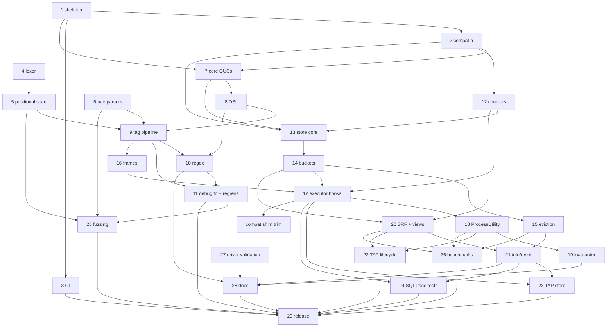

# pg_stat_statement_context — Backlog

This backlog breaks [DESIGN.md](DESIGN.md) (Draft) into concrete, implementable
tasks. Section references (§N) point to DESIGN.md.

## How to read this backlog

**Task IDs** use the format `YYYYMMDD-HHMMSS-N`. The `YYYYMMDD-HHMMSS` part is
the local time at which a batch of tasks was written, and `N` numbers the tasks
in that batch sequentially from 1. Every task in this file shares the prefix
`20261005-091225`. To add tasks, use your own current timestamp as the prefix
and start again at 1, so that people adding tasks at the same time don't create
the same ID. Never renumber or reuse an ID.

**Fields** for each task:

- **Description**: what to build, scoped so that one engineer or agent can
  complete it, with references to DESIGN.md.
- **Acceptance criteria**: brief, testable conditions for done.
- **Depends on**: task IDs that must be finished first, or `none`.
- **Open questions**: undecided design questions that must be answered
  **before** the task can start, or `none`. These cover only things that
  DESIGN.md leaves open, ambiguous, or TBD. Smaller choices that an implementer
  can make on their own, then document and confirm in review, are listed as
  *Design notes* instead and don't block the task.
- **Status**:
  - `ready`: every dependency is done and there are no open questions.
  - `blocked-on-deps`: there are no open questions, but at least one dependency
    is unfinished.
  - `blocked-on-questions`: the task has open questions. This status takes
    precedence when a task also has unfinished dependencies, because the
    questions can be answered now, in parallel with the dependency work.
    Dependencies are still listed in the table.

The backlog has two parts: **v1** (tasks 1–29, plus later additions
20261005-101154-1 and 20261005-103941-1) and the **post-v1 roadmap** (tasks
30, 32–35, 38, 39, 41, 42, 45, and 46, §8). Roadmap tasks 31, 36, 37, 40, 43,
and 44 were dropped on 2026-10-05 as out of scope for a `pg_stat_statements`
companion; they are archived under "Dropped" in BACKLOG-COMPLETE.md. Any
roadmap task that adds SQL objects or columns must ship
an extension upgrade script (for example `--1.0--1.1.sql`) rather than edit the
frozen 1.0 script.

**Scope decision (2026-10-05):** the extension is a companion to
`pg_stat_statements`, not a replacement. Per (queryid × context) it stores only
`calls` and `total_exec_time`; every other statistic comes from pgss via a join
on `(userid, dbid, queryid, toplevel)` (DESIGN.md §5.1, §7).

## Summary

| ID | Title | Depends on | Has open questions | Status |
|----|-------|------------|--------------------|--------|
| 20261005-091225-29 | v1 release readiness | 20261005-091225-3, 20261005-091225-11, 20261005-091225-22, 20261005-091225-23, 20261005-091225-24, 20261005-091225-25, 20261005-091225-26, 20261005-091225-28, 20261005-213120-1, 20261006-010149-1, 20261005-091225-32, 20261007-070036-1, 20261007-133120-1, 20261008-065635-1, 20261008-065635-2, 20261008-065635-3 | no | ready |
| 20261008-065635-13 | Benchmark requalification on the release commit | 20261008-065635-1, 20261008-065635-2, 20261008-065635-3 | no | ready |
| 20261008-065635-14 | Release-tree and design-doc cleanup | 20261008-065635-13 | no | blocked-on-deps |
| 20261005-091225-45 | Roadmap: distribution packaging and provider outreach | 20261005-091225-29 | no | blocked-on-deps |
| 20261005-091225-46 | Roadmap: upstream proposal for a statement-comment hook | 20261005-091225-26, 20261005-091225-29 | no | blocked-on-deps |

### How the DESIGN.md §11 open questions were resolved

All seven §11 questions were answered by the project owner on 2026-10-05.

| §11 question | Resolution | Recorded in task |
|--------------|------------|------------------|
| Q1: record the empty tag set by default? | No: `untagged = skip` is the default | 20261005-091225-29 |
| Q2: `jsonb` vs fixed columns for `tags` | `jsonb` | 20261005-091225-20 |
| Q3: DSL in one GUC vs a `config_file` | GUCs only; `ALTER SYSTEM` + `pg_reload_conf()` from SQL | 20261005-091225-31 (dropped), 20261005-091225-28 |
| Q4: is `utility_textid` worth it? | No; pgss has the same PG14/15 behavior | 20261005-091225-37 (dropped) |
| Q5: `bucket_id` in key vs per-entry bucket ring | Per-entry counter ring | 20261005-091225-13, -14, -15 |
| Q6: error-count dedup rules; cancellations separate? | Moot: error counts dropped | 20261005-091225-40 (dropped) |
| Q7: load-order violation: `WARNING` vs disable utility tracking | `WARNING` only | 20261005-091225-19 |

Other blocking questions came up while decomposing the design. Those on tasks
8, 9, 12, 21, 30, 32, 35, 38, and 41 were answered on 2026-10-05 (see each
task's **Decisions**). No task currently has open questions.

### Dependency overview (v1)

Short labels: `T1` = `20261005-091225-1`, and so on.

`C1` = `20261005-103941-1`. No v1 task has open questions any more (so none is
marked `?`). Every dependency points to a lower-numbered task, or (for `C1`)
to an older task, so the graph is acyclic. 20261005-101154-1 has no
dependencies and is not shown.

---

## v1 tasks

### 20261005-091225-29: v1 release readiness

**Description:** Prepare and cut the v1.0 release:
- Confirm the defaults (including `untagged = skip`), then freeze `--1.0.sql`. Later changes go into upgrade scripts.
- Verify `make install` from a clean checkout on every CI cell, including the assert and Valgrind jobs.
- Check that the benchmark numbers are published.
- Check that DESIGN.md §11 records how each question was resolved (done on 2026-10-05) and that the release notes summarize them.
- Add a CHANGELOG, tag `v1.0.0`, and create a GitHub release.

**Acceptance criteria:**
- The checklist is complete, CI is green, the tag and release exist, and the README install steps work from a clean checkout.

**Decisions:**
- 2026-10-05 (§11 Q1): Untagged statements are **skipped** by default (`untagged = skip`); `untagged = record` stays available. The sizing guidance assumes this default.
- 2026-10-06 (Q1): Finish 20261005-213120-1 and 20261006-010149-1 before freezing `--1.0.sql`.
- 2026-10-06 (Q2): Moot; 20261006-043919-1 landed. 20261006-075124-1 is not a v1 blocker.
- 2026-10-06 (Q3): The **owner** pushes, tags `v1.0.0` and creates the GitHub release. The agent prepares everything locally (CHANGELOG, release notes, freeze) and stops before pushing.
- 2026-10-06: v1.0 ships the roadmap features already built: appname, normalize, activity view, tags_override, and per-key cardinality caps (20261005-091225-32).
- 2026-10-06 (owner, after -33/-34/-35 landed): **fold 1.1 into 1.0.** 1.0 was never released, so the first release is HEAD as v1.0.0: `--1.0--1.1.sql` (exemplars) is merged into `sql/pg_stat_statement_context--1.0.sql`, the upgrade script is deleted, `default_version = '1.0'`, and `sql/frozen.sha256` holds the new checksum. The freeze policy is unchanged: from v1.0.0 on, SQL changes go into upgrade scripts. v1.0.0 also ships the reclaim worker (-34), persistence (`save`, -35) and exemplars (-33).

**Progress (2026-10-06, agent):** everything up to the owner's steps is done:
- `untagged` defaults to `skip` (`src/guc.c`). `--1.0.sql` is frozen (header comment, `sql/frozen.sha256`, `scripts/check-frozen-sql.sh` in CI and `docker/run-tests.sh`; DESIGN.md §7).
- `CHANGELOG.md` and `docs/release-notes/v1.0.0.md` added; the notes summarize the §11 resolutions. §11 is accurate. Benchmark numbers are committed in `docs/benchmarks.md`.
- Local matrix in Docker: PGDG 14–18, `--assert` 14–18 and `--valgrind 18` all pass; README install + quick start verbatim from a fresh `git clone` on PG 14 and 18.
- Fixed on the way: `docker/Dockerfile.source` passed the release as `ARG PG_VERSION`, which the base image's `ENV PG_VERSION` overrides under the legacy builder (tarball 404); renamed to `PG_SOURCE_VERSION`.
- (Superseded by the progress note below: -33, -34 and -35 landed afterwards.)

**Progress (2026-10-06 evening, agent, after the 1.1 fold; commit 6264c97):**
- 1.1 folded into 1.0 per the owner's decision above: `--1.0.sql` defines the exemplar columns, `--1.0--1.1.sql` and the `_1_1` C symbols are gone, `default_version = '1.0'`, `sql/frozen.sha256` re-recorded (`scripts/check-frozen-sql.sh` has no re-record mode, so the manifest line was edited). A catalog comparison on PG 18 of old 1.0 + upgrade vs. the folded script showed identical signatures, volatility/parallel/strict labels, ACLs and view definitions (only the C symbol names differ).
- CHANGELOG `[1.0.0]` and `docs/release-notes/v1.0.0.md` now include the reclaim worker, `save` and exemplars; they are off the post-v1 list. `save` is now documented in `docs/configuration.md`; limitations/sql-interface/integrations no longer say statistics are lost on every restart. DESIGN.md §6.13, §7, §8, §9 updated; §11 unchanged and accurate.
- Matrix from a fresh `git clone` of 6264c97 (`scripts/docker-test.sh`): PGDG 14.24, 15.19, 16.15, 17.11, 18.6 PASS; `--assert` 14.24, 15.19, 17.11, 18.6 PASS; `--assert` 16.15 FAIL once (timing flake in `017_lifecycle.pl`: a `RELEASE SAVEPOINT` took 5.6 ms in our hook vs 0.11 ms in pgss's, over the 2 ms slack; unrelated to the fold), PASS on rerun, tracked as 20261006-220356-1; `--valgrind 18` PASS (no Valgrind errors in 13 + 33 processes). Unit tests (ASan/UBSan), version-guard and frozen-SQL checks (+ self-tests) pass in every cell and on the host. `fuzz/run-libfuzzer.sh -t 15`: all 4 targets ok.
- README install + quick start verbatim (code blocks extracted from the committed README) from the fresh clone on PG 14 and 18: `make`, `make install`, both `CREATE EXTENSION`s, the quick-start output matches (2 rows, calls 2 and 1), `_extract()` returns the documented tags, extversion 1.0, no server-log warnings.
- Not run: `scripts/test-integrations.sh` (pulling the third-party images failed in this environment: Docker credential helper error).
- Benchmarks in `docs/benchmarks.md` were measured at 22f9e0f, before -33/-34/-35 (all off by default or off the hot path); not re-run.
- **Remaining (owner):** push `main`, wait for CI to be green, tag `v1.0.0`, create the GitHub release from `docs/release-notes/v1.0.0.md`, then run `scripts/backlog-complete.py 20261005-091225-29`.

**Progress (2026-10-07, agent, matrix rerun on cd7dbc9 after the security fixes 4167f96/3fb341a, the upstream merge ccd297b and the flake fixes dbbc976/25f5b35/7d84415):**
- Matrix from a fresh `git clone` of cd7dbc9 (`scripts/docker-test.sh`, cells run one after another): PGDG 14.24, 15.19, 16.15, 17.11, 18.6 PASS; `--assert` 14.24, 15.19, 16.15, 17.11, 18.6 PASS, all on the first run (no flakes); `--valgrind` 18.6 PASS (no Valgrind errors in 13 + 33 processes; the 6 pg_regress tests pass). Unit tests (ASan/UBSan), version-guard and frozen-SQL checks (+ self-tests) pass in every cell. On the host (macOS), the version-guard and frozen-SQL checks pass. The host unit tests and `make -C fuzz check` pass with `SANITIZE="-fsanitize=undefined -fno-sanitize-recover=all"`. Under ASan they could not run in this environment: even an empty `-fsanitize=address` binary hangs at startup. They ran under ASan in every Docker cell.
- `fuzz/run-libfuzzer.sh -t 15`: all 4 targets ok.
- README install + quick start (code blocks extracted from the committed README) from a fresh clone in the PGDG 14 and 18 images: `make`, `make install`, both `CREATE EXTENSION`s, the quick-start output matches (2 rows, calls 2 and 1), `_extract()` returns the documented tags, extversion 1.0, no server-log warnings.
- `scripts/test-integrations.sh`: still not runnable here. Pulling `quay.io/prometheuscommunity/postgres-exporter:v0.20.1` fails with the same Docker credential helper error (`error getting credentials ... (-50)`).
- CHANGELOG.md and `docs/release-notes/v1.0.0.md` don't hard-code the matrix commit or results. They already describe the (role, database) cap scope. The owner steps above still apply; `main` is 27 commits ahead of `origin/main`. Note: CHANGELOG `[1.0.0]` is dated 2026-10-06; adjust it if the tag is cut later.

**Progress (2026-10-07, agent, matrix rerun on d8f3333 after the per-database settings change f13607c):**
- Matrix from a fresh `git clone` of d8f3333, cells run one after another: PGDG 14.24, 15.19, 16.15, 17.11, 18.6 PASS; `--assert` 14–18 PASS; `--valgrind` 18.6 PASS (no Valgrind errors). Everything passed on the first run. Version-guard and frozen-SQL checks (+ self-tests) pass on the host and in every cell; host unit tests and `make -C fuzz check` pass under UBSan.
- `fuzz/run-libfuzzer.sh -t 15`: all 4 targets ok. `fuzz/sql/run.sh --pgdg --pg 18 -- --duration 30`: 528 rounds, 0 oracle errors.
- README install + quick start from a fresh clone on PGDG 14 and 18: PASS.
- `scripts/test-integrations.sh`: still blocked by the Docker credential helper error.

**Progress (2026-10-08, agent, matrix rerun on eafa267 after the RDS-readiness items -1, -2, -3, -4, -7, -8, -10, -11 landed):**
- Run from a detached worktree at eafa267, cells one after another (other builders' Docker runs were active at the same time): PGDG 14.24, 15.19, 16.15, 17.11, 18.6 PASS (each cell now runs the testing build's full suite, the release-export check, and the release build's pg_regress and TAP pass, from -3); `--assert` 15–18 PASS; `--valgrind` 18.6 PASS.
- `--assert` 14.24 FAIL once: `006_regex.pl` tests 328 and 332 (regex deadline mid-compile retries, timing under load). It passed in 2 of 2 reruns. Tracked as 20261008-120000-1.
- `sql/frozen.sha256` matches the re-recorded 1.0 script (it includes `_counters()` and `_info_1_0` from -2).
- Not run: the README install from a fresh clone, libFuzzer, `scripts/test-integrations.sh` (Docker credential helper error, as before). Rerun the matrix and the README check once the remaining doc/test items have landed, before tagging.

**Depends on:** 20261005-091225-3, 20261005-091225-11, 20261005-091225-22, 20261005-091225-23, 20261005-091225-24, 20261005-091225-25, 20261005-091225-26, 20261005-091225-28, 20261005-213120-1, 20261006-010149-1, 20261005-091225-32, 20261007-070036-1 (security fix, must land before the tag; the release matrix must be rerun after it); 20261007-133120-1 (per-database settings, owner request 2026-10-07; rerun the matrix after it); 20261008-065635-1, 20261008-065635-2, 20261008-065635-3 (RDS-readiness code/SQL items, owner decision 2026-10-08; rerun the matrix and re-record frozen.sha256 after them)
**Open questions:** none
**Status:** ready

---

## RDS-readiness tasks (2026-10-08)

These come from an RDS-acceptance review on 2026-10-08 (five reviewers plus an independent vetter; reports were kept in the git-ignored `tmp/review/`). Decisions by the owner on 2026-10-08:
- Only the code/SQL items (-1, -2, -3) block the v1.0.0 tag (20261005-091225-29). Docs, tests and benchmarks follow later.
- `v1.0.0` is not tagged, so SQL-surface changes go into the unreleased `--1.0.sql` and `sql/frozen.sha256` is re-recorded, as was done for the 1.1 fold. Check catalog equivalence apart from the intended changes.
- Benchmarks: the agent writes reproducible scripts and runs them locally in Docker, with caveats. The owner runs them on dedicated Linux x86/Graviton hosts later.
- `_info()`: keep `oldest_bucket` exact, but bound the retry and add a cheap counters-only function for scrapers.
- Long-statement scans: measure and document only; no new byte-budget GUC.
- Per-key caps don't bound tag-set combinations: document it and export the health counters; no new combination-budget feature.

### 20261008-065635-13: Benchmark requalification on the release commit

**Description:** TST-1, TST-2, TST-11, PERF-1, PERF-2, PERF-4, PERF-5 and PERF-11. The numbers in `docs/benchmarks.md` were measured at 22f9e0f, before 19 later commits touched `src/`. They come from a noisy M1 laptop running Docker, and they don't cover prepared statements, writes, high client counts, concurrent readers, multi-entry stores, or long statements. Per the owner's decision (2026-10-08), make the benchmark suite reproducible and complete, run it locally in Docker with clear caveats, and leave the dedicated-hardware runs to the owner.
- Extend `bench/` with scenarios for:
  - simple and prepared (`-M prepared`) protocol
  - read-only and write (pgbench TPC-B-like) workloads
  - client counts of 1, CPU count, 4× CPU count and (opt-in) 256
  - pgss-only vs pgss + this extension (untagged skip, tagged, regex/normalize configured)
  - a pre-populated store with thousands of entries
  - a periodic reader that runs the exporter recipe's queries every 15 s (and an aggressive 1 s variant)
  - nested PL/pgSQL loops
  - long statements (10k-element IN lists, with `position = append` and `position = any`, and with or without a trailing `;`)
- Record CPU/statement and the p50/p95/p99 latency, plus TPS. Run enough paired, interleaved repetitions to report a confidence interval, not min/max of two pairs.
- Each run stores its raw results with the commit, the settings and a host description under `bench/results/<date>-<host>/` (committed, small), and `docs/benchmarks.md` is regenerated from them.
- Add a `bench/README` (or a docs section) with exact instructions for the owner's dedicated Linux x86 and Graviton runs.
- Rewrite claims in DESIGN.md, the release notes and the README so they match what the data supports. If the local data can't bound the overhead, say so explicitly.
- Document the long-statement scan costs (`position = any` scans the full text; append without a trailing `;` needs a full `strlen`) and give tuning guidance (`scan_window`, `position`). No new byte-budget GUC (owner decision).

**Acceptance criteria:**
- `bench/run.sh` (or its successor) runs every scenario from one command. `bench/test_analyze.py` covers the new statistics.
- `docs/benchmarks.md` is generated from committed raw data at the current commit, and states the caveats. Instructions for dedicated hardware exist.

**Depends on:** 20261008-065635-1, 20261008-065635-2, 20261008-065635-3 (benchmark the code that will ship)
**Open questions:** none
**Status:** ready

### 20261008-065635-14: Release-tree and design-doc cleanup

**Description:** DOC-11, DOC-12, DOC-16, HYG-6 and HYG-7.
- Mark `DESIGN.md` as describing the implemented v1.0, not a "Draft". Fix its stale passages: roadmap items that have shipped, the planner-hook description, and the "Repository layout (proposed)" section. Make sure §11 is still accurate.
- Make user docs stop pointing into `research/`, `BACKLOG*.md` or other development material, or mark those links clearly as developer references.
- Add `.gitattributes` `export-ignore` rules so `git archive` and release tarballs leave out agent and planning files (`CLAUDE.md`, `BACKLOG*.md`, `worktrees/`, `tmp/`) and, if the owner agrees in review, `research/` and `bench/results/`. Check that `make`/`make install`/the tests still work from a `git archive` tarball.
- Remove backlog-ID citations from source comments where they don't help a maintainer. Keep the explanation; drop the ID.
- Add a short glossary to the README or docs (tag, tag set, context, key, extractor, frame, bucket).
- HYG-7 (owner action, not agent work): copyright ownership and contributor attestation for an MIT-licensed project developed with AI assistance. Add a `NOTICE`/`AUTHORS` stub and a line in README about who holds the copyright, wording to be supplied by the owner. Leave a TODO for the owner in the item if they haven't supplied it.

**Acceptance criteria:**
- `git archive HEAD | tar -t` leaves out the listed files. A clean build and `make installcheck` from the extracted tarball pass in Docker.
- No user doc links to development-only files, unless the link is labeled as such. The DESIGN.md status and sections are accurate.

**Depends on:** 20261008-065635-13 (so DESIGN.md benchmark claims are rewritten once)
**Open questions:** none
**Status:** blocked-on-deps

---

## Post-v1 roadmap tasks (§8)

### 20261005-091225-45: Roadmap: distribution packaging and provider outreach

**Description:** Package and distribute the extension (§8 v3):
- PGXN `META.json` and an upload
- PGDG apt/yum packaging requests
- a Homebrew formula
- Docker images based on the official postgres images

Also contact the managed providers (RDS, Cloud SQL, Azure) about adding the extension to their allowlists (§6.12).

**Acceptance criteria:**
- Each package installs, and `CREATE EXTENSION` works.
- The outreach is logged, with contacts and status.

**Depends on:** 20261005-091225-29
**Open questions:** none
**Status:** blocked-on-deps

### 20261005-091225-46: Roadmap: upstream proposal for a statement-comment hook

**Description:** Write and send a pgsql-hackers proposal for a core hook or field for statement comments, or a query-tag mechanism, that would benefit pgss and similar extensions (§8 v3). Use the benchmark data and the limitations (§6.2, §6.3, §6.6) as motivation.

**Acceptance criteria:**
- The proposal is posted, and the thread link and outcome are recorded in the repository.

**Depends on:** 20261005-091225-26, 20261005-091225-29
**Open questions:** none
**Status:** blocked-on-deps
