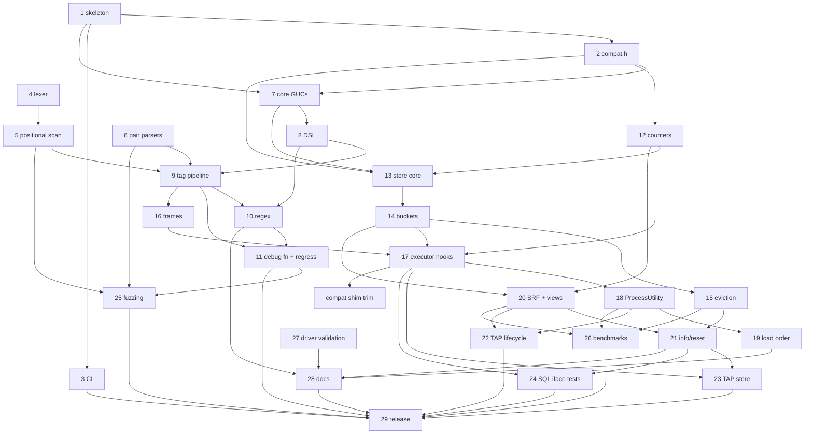

# pg_stat_statement_context — Backlog

This backlog breaks [DESIGN.md](DESIGN.md) (Draft) into concrete, implementable
tasks. Section references (§N) point to DESIGN.md.

## How to read this backlog

**Task IDs** use the format `YYYYMMDD-HHMMSS-N`. The `YYYYMMDD-HHMMSS` part is
the local time at which a batch of tasks was written, and `N` numbers the tasks
in that batch sequentially from 1. Every task in this file shares the prefix
`20261005-091225`. To add tasks, use your own current timestamp as the prefix
and start again at 1, so that people adding tasks at the same time don't create
the same ID. Never renumber or reuse an ID.

**Fields** for each task:

- **Description**: what to build, scoped so that one engineer or agent can
  complete it, with references to DESIGN.md.
- **Acceptance criteria**: brief, testable conditions for done.
- **Depends on**: task IDs that must be finished first, or `none`.
- **Open questions**: undecided design questions that must be answered
  **before** the task can start, or `none`. These cover only things that
  DESIGN.md leaves open, ambiguous, or TBD. Smaller choices that an implementer
  can make on their own, then document and confirm in review, are listed as
  *Design notes* instead and don't block the task.
- **Status**:
  - `ready`: every dependency is done and there are no open questions.
  - `blocked-on-deps`: there are no open questions, but at least one dependency
    is unfinished.
  - `blocked-on-questions`: the task has open questions. This status takes
    precedence when a task also has unfinished dependencies, because the
    questions can be answered now, in parallel with the dependency work.
    Dependencies are still listed in the table.

The backlog has two parts: **v1** (tasks 1–29, plus later additions
20261005-101154-1 and 20261005-103941-1) and the **post-v1 roadmap** (tasks
30, 32–35, 38, 39, 41, 42, 45, and 46, §8). Roadmap tasks 31, 36, 37, 40, 43,
and 44 were dropped on 2026-10-05 as out of scope for a `pg_stat_statements`
companion; they are archived under "Dropped" in BACKLOG-COMPLETE.md. Any
roadmap task that adds SQL objects or columns must ship
an extension upgrade script (for example `--1.0--1.1.sql`) rather than edit the
frozen 1.0 script.

**Scope decision (2026-10-05):** the extension is a companion to
`pg_stat_statements`, not a replacement. Per (queryid × context) it stores only
`calls` and `total_exec_time`; every other statistic comes from pgss via a join
on `(userid, dbid, queryid, toplevel)` (DESIGN.md §5.1, §7).

## Summary

| ID | Title | Depends on | Has open questions | Status |
|----|-------|------------|--------------------|--------|
| 20261005-091225-29 | v1 release readiness | 20261005-091225-3, 20261005-091225-11, 20261005-091225-22, 20261005-091225-23, 20261005-091225-24, 20261005-091225-25, 20261005-091225-26, 20261005-091225-28, 20261005-213120-1, 20261006-010149-1, 20261005-091225-32 | no | ready |
| 20261005-091225-33 | Roadmap: exemplars for excluded high-cardinality keys | 20261005-091225-17, 20261005-091225-20 | no | ready |
| 20261005-091225-34 | Roadmap: background worker reclaiming dead entries | 20261005-091225-15 | no | ready |
| 20261005-091225-35 | Roadmap: persist stats across clean restarts | 20261005-091225-15, 20261005-091225-21 | no | ready |
| 20261005-091225-45 | Roadmap: distribution packaging and provider outreach | 20261005-091225-29 | no | blocked-on-deps |
| 20261005-091225-46 | Roadmap: upstream proposal for a statement-comment hook | 20261005-091225-26, 20261005-091225-29 | no | blocked-on-deps |

### How the DESIGN.md §11 open questions were resolved

All seven §11 questions were answered by the project owner on 2026-10-05.

| §11 question | Resolution | Recorded in task |
|--------------|------------|------------------|
| Q1: record the empty tag set by default? | No: `untagged = skip` is the default | 20261005-091225-29 |
| Q2: `jsonb` vs fixed columns for `tags` | `jsonb` | 20261005-091225-20 |
| Q3: DSL in one GUC vs a `config_file` | GUCs only; `ALTER SYSTEM` + `pg_reload_conf()` from SQL | 20261005-091225-31 (dropped), 20261005-091225-28 |
| Q4: is `utility_textid` worth it? | No; pgss has the same PG14/15 behavior | 20261005-091225-37 (dropped) |
| Q5: `bucket_id` in key vs per-entry bucket ring | Per-entry counter ring | 20261005-091225-13, -14, -15 |
| Q6: error-count dedup rules; cancellations separate? | Moot: error counts dropped | 20261005-091225-40 (dropped) |
| Q7: load-order violation: `WARNING` vs disable utility tracking | `WARNING` only | 20261005-091225-19 |

Other blocking questions came up while decomposing the design. Those on tasks
8, 9, 12, 21, 30, 32, 35, 38, and 41 were answered on 2026-10-05 (see each
task's **Decisions**). No task currently has open questions.

### Dependency overview (v1)

Short labels: `T1` = `20261005-091225-1`, and so on.

`C1` = `20261005-103941-1`. No v1 task has open questions any more (so none is
marked `?`). Every dependency points to a lower-numbered task, or (for `C1`)
to an older task, so the graph is acyclic. 20261005-101154-1 has no
dependencies and is not shown.

---

## v1 tasks

### 20261005-091225-29: v1 release readiness

**Description:** Prepare and cut the v1.0 release:
- Confirm the defaults (including `untagged = skip`), then freeze `--1.0.sql`. Later changes go into upgrade scripts.
- Verify `make install` from a clean checkout on every CI cell, including the assert and Valgrind jobs.
- Check that the benchmark numbers are published.
- Check that DESIGN.md §11 records how each question was resolved (done on 2026-10-05) and that the release notes summarize them.
- Add a CHANGELOG, tag `v1.0.0`, and create a GitHub release.

**Acceptance criteria:**
- The checklist is complete, CI is green, the tag and release exist, and the README install steps work from a clean checkout.

**Decisions:**
- 2026-10-05 (§11 Q1): Untagged statements are **skipped** by default (`untagged = skip`); `untagged = record` stays available. The sizing guidance assumes this default.
- 2026-10-06 (Q1): Finish 20261005-213120-1 and 20261006-010149-1 before freezing `--1.0.sql`.
- 2026-10-06 (Q2): Moot; 20261006-043919-1 landed. 20261006-075124-1 is not a v1 blocker.
- 2026-10-06 (Q3): The **owner** pushes, tags `v1.0.0` and creates the GitHub release. The agent prepares everything locally (CHANGELOG, release notes, freeze) and stops before pushing.
- 2026-10-06: v1.0 ships the roadmap features already built: appname, normalize, activity view, tags_override, and per-key cardinality caps (20261005-091225-32).

**Progress (2026-10-06, agent):** everything up to the owner's steps is done:
- `untagged` defaults to `skip` (`src/guc.c`). `--1.0.sql` is frozen (header comment, `sql/frozen.sha256`, `scripts/check-frozen-sql.sh` in CI and `docker/run-tests.sh`; DESIGN.md §7).
- `CHANGELOG.md` and `docs/release-notes/v1.0.0.md` added; the notes summarize the §11 resolutions. §11 is accurate. Benchmark numbers are committed in `docs/benchmarks.md`.
- Local matrix in Docker: PGDG 14–18, `--assert` 14–18 and `--valgrind 18` all pass; README install + quick start verbatim from a fresh `git clone` on PG 14 and 18.
- Fixed on the way: `docker/Dockerfile.source` passed the release as `ARG PG_VERSION`, which the base image's `ENV PG_VERSION` overrides under the legacy builder (tarball 404); renamed to `PG_SOURCE_VERSION`.
- **Remaining (owner):** push `main`, wait for CI to be green, tag `v1.0.0`, create the GitHub release from `docs/release-notes/v1.0.0.md`, then run `scripts/backlog-complete.py 20261005-091225-29`.

**Depends on:** 20261005-091225-3, 20261005-091225-11, 20261005-091225-22, 20261005-091225-23, 20261005-091225-24, 20261005-091225-25, 20261005-091225-26, 20261005-091225-28, 20261005-213120-1, 20261006-010149-1, 20261005-091225-32
**Open questions:** none
**Status:** ready

---

## Post-v1 roadmap tasks (§8)

### 20261005-091225-33: Roadmap: exemplars for excluded high-cardinality keys

**Description:** Store the most recent value of explicitly listed high-cardinality keys (for example `traceparent`) per entry, so users can jump from an aggregate to a real trace (§8 v1.x). The visibility rules from §6.11 apply.

*Owner's note (2026-10-05):* the task is kept. An exemplar stores the most recent value of a high-cardinality key (e.g. `traceparent`) per entry.

**Acceptance criteria:**
- The exemplar column shows the latest value without adding new entries.
- It is `NULL` for unprivileged roles viewing other roles' rows.
- Only keys in the exemplar GUC are stored. Total exemplar memory never exceeds the configured cap.
- The upgrade script is provided.

**Depends on:** 20261005-091225-17, 20261005-091225-20
**Decisions (2026-10-05):**
- Exemplar keys come from an explicit list in a dedicated GUC (e.g. `pg_stat_statement_context.exemplar_keys`). The denylist (`exclude_tags`) does not double as the exemplar list. A key may need to be both denylisted (so it isn't grouped by) and listed as an exemplar.
- Exemplar storage has a memory cap set by a config value (a postmaster-level GUC, since it sizes shared memory). Values that would exceed the cap are truncated or dropped (implementer's choice, documented and counted in `_info()`).

**Open questions:** none

**Status:** ready

### 20261005-091225-34: Roadmap: background worker reclaiming dead entries

**Description:** Add an optional background worker that, on idle systems, advances `current_bucket` and reclaims dead entries (every ring slot expired) so their space is free before the next insert needs it (§8 v1.x, §5.2, §5.3). It isn't needed for correctness, because readers already filter expired slots and eviction reclaims dead entries first. Enable it with a postmaster GUC.

**Acceptance criteria:**
- With the worker enabled, dead entries are freed without any query traffic, and `_info().entries` drops accordingly.
- Disabling it changes nothing else.

**Depends on:** 20261005-091225-15
**Open questions:** none
**Status:** ready

### 20261005-091225-35: Roadmap: persist stats across clean restarts

**Description:** Dump the stats at shutdown and load them at startup, like `pg_stat_statements.save` (§8 v1.x). Use a versioned file format with a header that records the extension version, epoch, `bucket_interval`, `bucket_count`, and sizing. Follow pgss's lead on mismatches:
- On a file-format or extension-version mismatch, discard the file.
- If `bucket_interval` or `bucket_count` changed, discard the file (pgss has no bucket analogue).
- If `max_entries` shrank, load what fits and evict the rest using the §5.3 order.
- Otherwise keep the stored epoch, so `bucket_id`s stay valid, and drop slots that expired during the downtime.

*Design note* (non-blocking): `max_tagset_bytes` changes are not covered by the decision. Proposed: load entries whose tag set still fits the new limit and skip (and log a count of) the rest.

**Acceptance criteria:**
- Stats survive a clean restart.
- Each mismatch case above behaves as specified, with a log message.
- A crash or a corrupt file starts empty with a log message.
- The behavior is controlled by a GUC.

**Decisions:**
- 2026-10-05: Follow pg_stat_statements: discard on format/version mismatch; if `max_entries` shrank, load what fits and evict the rest; if `bucket_interval` or `bucket_count` changed, discard.

**Depends on:** 20261005-091225-15, 20261005-091225-21
**Open questions:** none
**Status:** ready

### 20261005-091225-45: Roadmap: distribution packaging and provider outreach

**Description:** Package and distribute the extension (§8 v3):
- PGXN `META.json` and an upload
- PGDG apt/yum packaging requests
- a Homebrew formula
- Docker images based on the official postgres images

Also contact the managed providers (RDS, Cloud SQL, Azure) about adding the extension to their allowlists (§6.12).

**Acceptance criteria:**
- Each package installs, and `CREATE EXTENSION` works.
- The outreach is logged, with contacts and status.

**Depends on:** 20261005-091225-29
**Open questions:** none
**Status:** blocked-on-deps

### 20261005-091225-46: Roadmap: upstream proposal for a statement-comment hook

**Description:** Write and send a pgsql-hackers proposal for a core hook or field for statement comments, or a query-tag mechanism, that would benefit pgss and similar extensions (§8 v3). Use the benchmark data and the limitations (§6.2, §6.3, §6.6) as motivation.

**Acceptance criteria:**
- The proposal is posted, and the thread link and outcome are recorded in the repository.

**Depends on:** 20261005-091225-26, 20261005-091225-29
**Open questions:** none
**Status:** blocked-on-deps
