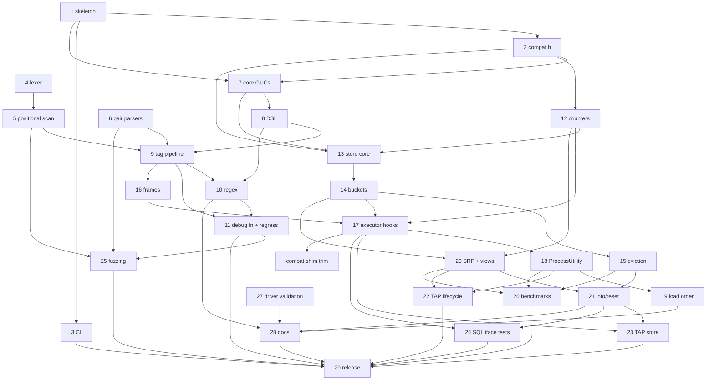

# pg_stat_statement_context — Backlog

This backlog breaks [DESIGN.md](DESIGN.md) (Draft) into concrete, implementable
tasks. Section references (§N) point to DESIGN.md.

## How to read this backlog

**Task IDs** use the format `YYYYMMDD-HHMMSS-N`. The `YYYYMMDD-HHMMSS` part is
the local time at which a batch of tasks was written, and `N` numbers the tasks
in that batch sequentially from 1. Every task in this file shares the prefix
`20261005-091225`. To add tasks, use your own current timestamp as the prefix
and start again at 1, so that people adding tasks at the same time don't create
the same ID. Never renumber or reuse an ID.

**Fields** for each task:

- **Description**: what to build, scoped so that one engineer or agent can
  complete it, with references to DESIGN.md.
- **Acceptance criteria**: brief, testable conditions for done.
- **Depends on**: task IDs that must be finished first, or `none`.
- **Open questions**: undecided design questions that must be answered
  **before** the task can start, or `none`. These cover only things that
  DESIGN.md leaves open, ambiguous, or TBD. Smaller choices that an implementer
  can make on their own, then document and confirm in review, are listed as
  *Design notes* instead and don't block the task.
- **Status**:
  - `ready`: every dependency is done and there are no open questions.
  - `blocked-on-deps`: there are no open questions, but at least one dependency
    is unfinished.
  - `blocked-on-questions`: the task has open questions. This status takes
    precedence when a task also has unfinished dependencies, because the
    questions can be answered now, in parallel with the dependency work.
    Dependencies are still listed in the table.

The backlog has two parts: **v1** (tasks 1–29, plus later additions
20261005-101154-1 and 20261005-103941-1) and the **post-v1 roadmap** (tasks
30, 32–35, 38, 39, 41, 42, 45, and 46, §8). Roadmap tasks 31, 36, 37, 40, 43,
and 44 were dropped on 2026-10-05 as out of scope for a `pg_stat_statements`
companion; they are archived under "Dropped" in BACKLOG-COMPLETE.md. Any
roadmap task that adds SQL objects or columns must ship
an extension upgrade script (for example `--1.0--1.1.sql`) rather than edit the
frozen 1.0 script.

**Scope decision (2026-10-05):** the extension is a companion to
`pg_stat_statements`, not a replacement. Per (queryid × context) it stores only
`calls` and `total_exec_time`; every other statistic comes from pgss via a join
on `(userid, dbid, queryid, toplevel)` (DESIGN.md §5.1, §7).

## Summary

| ID | Title | Depends on | Has open questions | Status |
|----|-------|------------|--------------------|--------|
| 20261006-010149-1 | Exporter-friendly SQL surface: monotonic counters and bucket metadata | 20261005-091225-42 | yes | blocked-on-questions |
| 20261006-021334-1 | Bound regex compile cost (pathological patterns stall first tagged query) | 20261005-091225-10 | no | ready |
| 20261006-043919-1 | Reduce eviction-pass lock hold time (sustained churn triples p99) | 20261005-091225-26 | no | ready |
| 20261005-213120-1 | `_info()`: distinguish live eviction from expired-entry reclamation | 20261005-091225-21 | yes | blocked-on-questions |
| 20261005-091225-29 | v1 release readiness | 20261005-091225-3, 20261005-091225-11, 20261005-091225-22, 20261005-091225-23, 20261005-091225-24, 20261005-091225-25, 20261005-091225-26, 20261005-091225-28 | no | ready |
| 20261005-091225-30 | Roadmap: `tags_override` session/transaction context | 20261005-091225-18, 20261005-091225-27 | no | ready |
| 20261005-091225-32 | Roadmap: per-key cardinality caps (overflow → JSON `null`) | 20261005-091225-17, 20261005-091225-21 | no | ready |
| 20261005-091225-33 | Roadmap: exemplars for excluded high-cardinality keys | 20261005-091225-17, 20261005-091225-20 | no | ready |
| 20261005-091225-34 | Roadmap: background worker reclaiming dead entries | 20261005-091225-15 | no | ready |
| 20261005-091225-35 | Roadmap: persist stats across clean restarts | 20261005-091225-15, 20261005-091225-21 | no | ready |
| 20261005-091225-38 | Roadmap: context from `application_name` | 20261005-091225-9, 20261005-091225-17 | no | ready |
| 20261005-091225-39 | Roadmap: `pg_stat_statement_context_activity` view | 20261005-091225-18, 20261005-091225-20 | no | ready |
| 20261005-091225-45 | Roadmap: distribution packaging and provider outreach | 20261005-091225-29 | no | blocked-on-deps |
| 20261005-091225-46 | Roadmap: upstream proposal for a statement-comment hook | 20261005-091225-26, 20261005-091225-29 | no | blocked-on-deps |

### How the DESIGN.md §11 open questions were resolved

All seven §11 questions were answered by the project owner on 2026-10-05.

| §11 question | Resolution | Recorded in task |
|--------------|------------|------------------|
| Q1: record the empty tag set by default? | No: `untagged = skip` is the default | 20261005-091225-29 |
| Q2: `jsonb` vs fixed columns for `tags` | `jsonb` | 20261005-091225-20 |
| Q3: DSL in one GUC vs a `config_file` | GUCs only; `ALTER SYSTEM` + `pg_reload_conf()` from SQL | 20261005-091225-31 (dropped), 20261005-091225-28 |
| Q4: is `utility_textid` worth it? | No; pgss has the same PG14/15 behavior | 20261005-091225-37 (dropped) |
| Q5: `bucket_id` in key vs per-entry bucket ring | Per-entry counter ring | 20261005-091225-13, -14, -15 |
| Q6: error-count dedup rules; cancellations separate? | Moot: error counts dropped | 20261005-091225-40 (dropped) |
| Q7: load-order violation: `WARNING` vs disable utility tracking | `WARNING` only | 20261005-091225-19 |

Other blocking questions came up while decomposing the design. Those on tasks
8, 9, 12, 21, 30, 32, 35, 38, and 41 were answered on 2026-10-05 (see each
task's **Decisions**). No task currently has open questions.

### Dependency overview (v1)

Short labels: `T1` = `20261005-091225-1`, and so on.

`C1` = `20261005-103941-1`. No v1 task has open questions any more (so none is
marked `?`). Every dependency points to a lower-numbered task, or (for `C1`)
to an older task, so the graph is acyclic. 20261005-101154-1 has no
dependencies and is not shown.

---

## v1 tasks

### 20261006-010149-1: Exporter-friendly SQL surface: monotonic counters and bucket metadata

**Description:** Found while writing the exporter recipes (item -42). None of the views has a counter that only grows: `_totals` is a sliding window and bucket rows expire. So Prometheus `rate()` can't be used, and the recipes export gauges over the last closed bucket instead. They also hard-code the bucket length GUC and the hidden 2000-01-01 starting point for buckets. Proposed additions:
1. Bucket metadata in `_info()`: `bucket_seconds`, `current_bucket_start`, `last_closed_bucket_start`.
2. Optionally a `pg_stat_statement_context_last_bucket` view, which gives the last closed bucket per entry.
3. Optionally counters per entry that only grow (`calls_total`, `exec_time_total` plus `stats_since`) and survive bucket expiry until the entry is evicted. This costs extra shared-memory bytes per entry.
4. An epoch-number form of `stats_reset`, or let the recipes keep converting it.

Once this lands, simplify the recipes in `docs/integrations/` and update `scripts/test-integrations.sh`.

**Acceptance criteria:**
- The chosen columns or views exist, are documented in §7 and `docs/sql-interface.md`, and are tested in TAP or 019.
- The recipes no longer depend on the epoch or bucket-length GUC.

**Depends on:** 20261005-091225-42
**Open questions:**
- Q1: Which of 1–4 should be done? Item 3 changes the shared-memory entry size and the meaning of "evicted".
- Q2: Should this be combined with 20261005-213120-1, since both change the `_info()` columns?
**Status:** blocked-on-questions

### 20261006-021334-1: Bound regex compile cost (pathological patterns stall first tagged query)

**Description:** Found by the SQL fuzzer (item -25). The pattern `((?:(?:$)|\Zda|(?<!1)|\S){0,255}` takes over 20 s to compile, both in core `regexp_matches` and in our check hook. Only statement_timeout limited it, by cancelling the `ALTER SYSTEM`. If a superuser sets such a pattern with no statement_timeout, the check hook accepts it. Then every backend compiles it lazily on its first tagged statement (§4.2 regex), stalling a user query for seconds. A cancel or timeout during that compile is re-thrown into the user's query, which is worse than a stall.

The execution-time CPU limits (item -10) don't cover compile. Options (decide and document):
- Bound compile with a complexity heuristic in the check hook, e.g. reject `{m,n}` with large n around a group that can match empty, or cap pattern length and number of groups.
- Measure compile time in the check hook and reject patterns over a threshold (e.g. 100 ms). The check hook runs in the postmaster at reload, which is acceptable because the hook already compiles there.
- Use the engine's cancel mechanism (`rcancelrequested` callback) to abort a compile after N ms in backends, and treat it as a compile failure (counted in `regex_compile_failures`, extractor disabled for the backend) instead of re-throwing into the user's query.

**Acceptance criteria:**
- The fuzzer's pathological pattern is rejected at SET/reload, or, if it is accepted, a backend never spends more than the documented bound compiling it on the hot path and never fails the user's query because of it.
- Normal patterns from docs/extractors.md are unaffected.
- A test covers the case (TAP or pg_regress).

**Depends on:** 20261005-091225-10
**Open questions:** none
**Status:** ready

### 20261006-043919-1: Reduce eviction-pass lock hold time (sustained churn triples p99)

**Description:** Found by the benchmarks (item -26, docs/benchmarks.md). Under sustained eviction with high-cardinality tags at `max_entries=10000`, p99 latency rose from 0.477 ms (pgss alone) to 1.200 ms on PG 18.6 (+158%), and 5× on PG 14. TPS fell 12.5%. That was about 90 passes per second, each removing 500 entries. `store_evict()` in `src/store.c` (§5.3) holds the store's exclusive lock while it scans the whole table, copies every live entry, and sorts them all with `pssc_evict_sort()`. Every backend recording during a pass waits.

Options, in order of preference:
1. Choose the victims by partial selection instead of a full sort (quickselect or a bounded heap of size `nvictims`, O(n)). Eviction order stays the same: last_bucket, then usage.
2. Reuse the candidate buffer instead of allocating it each pass.
3. Make the batch bigger when passes come close together, so fewer passes run. This changes semantics: document it, and keep the §5.3 order.
4. Do the scan and sort under the shared lock with a generation check, and take the exclusive lock only to remove the victims. This is more complex; justify it with measurements first.

Measure each step with `bench/run.sh --only evict` and keep the semantics in §5.3 (victim order and `evicted_entries` accounting) intact; the existing TAP tests 008/018 must still pass.

**Acceptance criteria:**
- The eviction benchmark's p99 at `max_entries=10000` is no more than about 1.5× pgss alone on PG 18 (or the remaining gap is explained), with numbers updated in docs/benchmarks.md.
- Victim selection matches the old full sort exactly; a unit test compares them on random inputs, including ties.
- Full harness passes on PG 14–18.

**Depends on:** 20261005-091225-26
**Open questions:** none
**Status:** ready

### 20261005-213120-1: `_info()`: distinguish live eviction from expired-entry reclamation

**Description:** Found while documenting (item -28). `evicted_entries` counts both expired entries reclaimed by an eviction pass and live entries evicted, and `dealloc` counts passes. `dropped_records` (calls lost because a pass freed nothing) is not exposed. So `_info()` alone cannot tell an operator that `max_entries` is too small, contrary to DESIGN §5.3 step 3. The docs currently give a workaround: compare the row count of `pg_stat_statement_context_totals` with `max_entries`.

Proposed: split the counter into `reclaimed_entries` (expired or dead, harmless) and `evicted_entries` (live, history lost), and expose `dropped_records`. Update §5.3, §7, the docs and tests.

**Acceptance criteria:**
- Expired-only reclamation moves `reclaimed_entries`, not `evicted_entries`.
- Undersized churn moves `evicted_entries`.
- A full table with nothing to free moves `dropped_records`.
- The docs' undersizing guidance uses the new counters.

**Depends on:** 20261005-091225-21
**Open questions:**
- Q1: OK to change the `_info()` column set (§7, approved earlier) by renaming or splitting `evicted_entries` and adding `dropped_records`? Proposed names: `reclaimed_entries`, `evicted_entries` (live only), `dropped_records`.
**Status:** blocked-on-questions

### 20261005-091225-29: v1 release readiness

**Description:** Prepare and cut the v1.0 release:
- Confirm the defaults (including `untagged = skip`), then freeze `--1.0.sql`. Later changes go into upgrade scripts.
- Verify `make install` from a clean checkout on every CI cell, including the assert and Valgrind jobs.
- Check that the benchmark numbers are published.
- Check that DESIGN.md §11 records how each question was resolved (done on 2026-10-05) and that the release notes summarize them.
- Add a CHANGELOG, tag `v1.0.0`, and create a GitHub release.

**Acceptance criteria:**
- The checklist is complete, CI is green, the tag and release exist, and the README install steps work from a clean checkout.

**Decisions:**
- 2026-10-05 (§11 Q1): Untagged statements are **skipped** by default (`untagged = skip`); `untagged = record` stays available. The sizing guidance assumes this default.

**Depends on:** 20261005-091225-3, 20261005-091225-11, 20261005-091225-22, 20261005-091225-23, 20261005-091225-24, 20261005-091225-25, 20261005-091225-26, 20261005-091225-28
**Open questions:**
- Q1 (added 2026-10-06): Should 20261005-213120-1 and 20261006-010149-1 be decided, and done if accepted, before `--1.0.sql` is frozen? Both change the `_info()` columns, and after the freeze that needs a 1.0→1.1 upgrade script.
- Q2: Should 20261006-043919-1 (eviction p99 under churn) be fixed before v1? It's in progress now.
- Q3: May the agent push main, tag `v1.0.0` and create the GitHub release, or will the owner do that? CI has never run on GitHub, and the macOS cells are unverified until the first push.
**Status:** blocked-on-questions

---

## Post-v1 roadmap tasks (§8)

### 20261005-091225-30: Roadmap: `tags_override` session/transaction context

**Description:** Add a `USERSET` GUC, `pg_stat_statement_context.tags_override`, that can be set with `SET` or `SET LOCAL` (§8 v2, §6.3). It works with prepared statements and with drivers that can't add comments.
- **Syntax:** sqlcommenter style, `k='v',k2='v2'`, with URL-encoded values (for example `SET LOCAL pg_stat_statement_context.tags_override = 'controller=''users'',action=''show'''`). Parse it in a `check_hook` with the sqlcommenter parser (task 20261005-091225-6) into a flat `extra` blob; malformed values are rejected.
- **Combination:** override tags **merge** with tags from comments; on a key conflict the override value wins.
- **Pipeline:** override tags go through the same §6.11 pipeline as comment tags (decode and validation, `rename`, allowlist/denylist, truncation), except the per-extractor `keys` step.
- Apply it when top-level frames are created, so nested frames inherit it through the normal rules.

If task 20261005-091225-27 decides on go, this task moves into v1.

**Acceptance criteria:**
- With `SET LOCAL`, statements in the transaction get the override tags, and they no longer apply after commit.
- Prepared statements executed after the `SET` pick up the override.
- An override and a comment with disjoint keys produce the union; on a shared key the override value is stored.
- Override keys are renamed, filtered by the allowlist/denylist, and truncated exactly like comment tags.
- Invalid values (bad syntax, bad `%` escapes) are rejected at `SET` time.
- The feature is documented.

**Decisions:**
- 2026-10-05: Value syntax is sqlcommenter-style `k='v',k2='v2'` with URL-encoded values.
- 2026-10-05: Override tags merge with comment tags; the `SET` value wins on key conflicts.
- 2026-10-05: Override tags go through the same §6.11 pipeline (rename, allowlist/denylist, truncation).
- 2026-10-05: Item -27 decided **no-go** for v1 (no driver reuses prepared statements across comments; see DESIGN.md §6.3). This stays a roadmap item.

**Depends on:** 20261005-091225-18, 20261005-091225-27
**Open questions:** none
**Status:** ready

### 20261005-091225-32: Roadmap: per-key cardinality caps (overflow → JSON `null`)

**Description:** Cap the number of distinct values per allowed key (§6.1, §8 v1.x). Values beyond the cap collapse to JSON `null` before the key is built (§6.11 step 8, after truncation). A client can only send strings, so `null` can't collide with a real value. Count collapses in `_info()`.
- **Configuration:** a global default cap GUC plus optional per-key overrides.
- **Scope:** distinct values are counted globally per key (not per bucket or per `queryid`).

*Design notes* (propose and document; non-blocking):
- GUC names and the per-key override syntax, for example `cardinality_cap = 100` and `cardinality_cap_overrides = 'route:500|job:50'`.
- The shared structure that tracks distinct values per key (for example a fixed-size shared hash of `(key, value hash)`), its memory budget (postmaster-sized), and what happens when that structure itself is full.
- Whether the distinct-value sets are cleared by `_reset()` and/or decay over time.
- The canonical serialization of a `null` value in the key (it must differ from every string, e.g. a flag byte), and its `jsonb` output.

**Acceptance criteria:**
- Flooding an allowed key with random values produces at most *cap* distinct string values plus `null` for that key.
- Per-key overrides take precedence over the global default.
- `null` values appear as JSON `null` in `tags`, and are never produced by client input.
- Collapses are visible in `_info()`, and the upgrade script is provided.
- The hot path stays lock-free until the store write.

**Decisions:**
- 2026-10-05: Overflow values are represented as JSON `null`, replacing the earlier `<other>` literal.
- 2026-10-05 (adopted proposal, non-blocking): a global default cap GUC plus optional per-key overrides; distinct values counted globally per key. Remaining details are design notes.

**Depends on:** 20261005-091225-17, 20261005-091225-21
**Open questions:** none
**Status:** ready

### 20261005-091225-33: Roadmap: exemplars for excluded high-cardinality keys

**Description:** Store the most recent value of explicitly listed high-cardinality keys (for example `traceparent`) per entry, so users can jump from an aggregate to a real trace (§8 v1.x). The visibility rules from §6.11 apply.

*Owner's note (2026-10-05):* the task is kept. An exemplar stores the most recent value of a high-cardinality key (e.g. `traceparent`) per entry.

**Acceptance criteria:**
- The exemplar column shows the latest value without adding new entries.
- It is `NULL` for unprivileged roles viewing other roles' rows.
- Only keys in the exemplar GUC are stored. Total exemplar memory never exceeds the configured cap.
- The upgrade script is provided.

**Depends on:** 20261005-091225-17, 20261005-091225-20
**Decisions (2026-10-05):**
- Exemplar keys come from an explicit list in a dedicated GUC (e.g. `pg_stat_statement_context.exemplar_keys`). The denylist (`exclude_tags`) does not double as the exemplar list. A key may need to be both denylisted (so it isn't grouped by) and listed as an exemplar.
- Exemplar storage has a memory cap set by a config value (a postmaster-level GUC, since it sizes shared memory). Values that would exceed the cap are truncated or dropped (implementer's choice, documented and counted in `_info()`).

**Open questions:** none

**Status:** ready

### 20261005-091225-34: Roadmap: background worker reclaiming dead entries

**Description:** Add an optional background worker that, on idle systems, advances `current_bucket` and reclaims dead entries (every ring slot expired) so their space is free before the next insert needs it (§8 v1.x, §5.2, §5.3). It isn't needed for correctness, because readers already filter expired slots and eviction reclaims dead entries first. Enable it with a postmaster GUC.

**Acceptance criteria:**
- With the worker enabled, dead entries are freed without any query traffic, and `_info().entries` drops accordingly.
- Disabling it changes nothing else.

**Depends on:** 20261005-091225-15
**Open questions:** none
**Status:** ready

### 20261005-091225-35: Roadmap: persist stats across clean restarts

**Description:** Dump the stats at shutdown and load them at startup, like `pg_stat_statements.save` (§8 v1.x). Use a versioned file format with a header that records the extension version, epoch, `bucket_interval`, `bucket_count`, and sizing. Follow pgss's lead on mismatches:
- On a file-format or extension-version mismatch, discard the file.
- If `bucket_interval` or `bucket_count` changed, discard the file (pgss has no bucket analogue).
- If `max_entries` shrank, load what fits and evict the rest using the §5.3 order.
- Otherwise keep the stored epoch, so `bucket_id`s stay valid, and drop slots that expired during the downtime.

*Design note* (non-blocking): `max_tagset_bytes` changes are not covered by the decision. Proposed: load entries whose tag set still fits the new limit and skip (and log a count of) the rest.

**Acceptance criteria:**
- Stats survive a clean restart.
- Each mismatch case above behaves as specified, with a log message.
- A crash or a corrupt file starts empty with a log message.
- The behavior is controlled by a GUC.

**Decisions:**
- 2026-10-05: Follow pg_stat_statements: discard on format/version mismatch; if `max_entries` shrank, load what fits and evict the rest; if `bucket_interval` or `bucket_count` changed, discard.

**Depends on:** 20261005-091225-15, 20261005-091225-21
**Open questions:** none
**Status:** ready

### 20261005-091225-38: Roadmap: context from `application_name`

**Description:** Add a DSL extractor `appname(format=sqlcommenter|marginalia|regex)` that derives tags from `application_name` instead of comment text (§4.2, §8 v2). It parses with the named format's rules and parameters (`kv_sep`/`pair_sep`, `url_decode`, or `pattern`/`keys` for `regex`), and accepts the common `keys`/`rename` parameters. Its output goes through the §6.11 pipeline. Tags from comments win over `appname`-derived tags on key conflicts.

**Acceptance criteria:**
- Each `format` produces the expected tags from a matching `application_name`.
- On a key conflict, the comment's value is stored.
- Malformed values are dropped and counted.
- Invalid `appname(...)` parameters are rejected by the DSL `check_hook`.

**Decisions:**
- 2026-10-05: Parsed via a DSL extractor `appname(format=sqlcommenter|marginalia|regex)`.
- 2026-10-05: Comment tags win over `appname`-derived tags.

**Depends on:** 20261005-091225-9, 20261005-091225-17
**Open questions:** none
**Status:** ready

### 20261005-091225-39: Roadmap: `pg_stat_statement_context_activity` view

**Description:** Add a view that shows the **current** tags of each backend, as a companion to `pg_stat_activity` (§8 v2). Keep per-backend shared slots, sized `MaxBackends × max_tagset_bytes`, and update them when top-level frames are activated. The visibility rules from §6.11 apply.

**Acceptance criteria:**
- The view shows the running statement's tags joinable on `pid`.
- Tags are `NULL` for other roles without `pg_read_all_stats`.
- Hot-path overhead is benchmarked.

**Depends on:** 20261005-091225-18, 20261005-091225-20
**Open questions:** none
**Status:** ready

### 20261005-091225-45: Roadmap: distribution packaging and provider outreach

**Description:** Package and distribute the extension (§8 v3):
- PGXN `META.json` and an upload
- PGDG apt/yum packaging requests
- a Homebrew formula
- Docker images based on the official postgres images

Also contact the managed providers (RDS, Cloud SQL, Azure) about adding the extension to their allowlists (§6.12).

**Acceptance criteria:**
- Each package installs, and `CREATE EXTENSION` works.
- The outreach is logged, with contacts and status.

**Depends on:** 20261005-091225-29
**Open questions:** none
**Status:** blocked-on-deps

### 20261005-091225-46: Roadmap: upstream proposal for a statement-comment hook

**Description:** Write and send a pgsql-hackers proposal for a core hook or field for statement comments, or a query-tag mechanism, that would benefit pgss and similar extensions (§8 v3). Use the benchmark data and the limitations (§6.2, §6.3, §6.6) as motivation.

**Acceptance criteria:**
- The proposal is posted, and the thread link and outcome are recorded in the repository.

**Depends on:** 20261005-091225-26, 20261005-091225-29
**Open questions:** none
**Status:** blocked-on-deps
